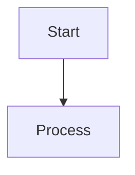

# Autonomous Development Workflows - Documentation Index

This directory contains research materials and documentation for the presentation on "Autonomous Development Workflows." All resources are organized to support the key points outlined in the main README.

## 🚀 Quick Start

**New to Autonomous Development?** Start here:
- **[Getting Started Guide](getting-started.md)** - Practical steps to build your first autonomous system
  - Choose your first use case
  - Pick the right architecture pattern
  - Set up your environment
  - Implement and iterate

## Document Organization

### 1. Model Context Protocol (MCP)

**Directory**: `/docs/mcp/`

Core documentation on MCP specification and implementation patterns.

| Document | Description | Presentation Relevance |
|----------|-------------|----------------------|
| [README.md](mcp/README.md) | MCP overview and key concepts | Tool and resource definitions |
| [architecture.md](mcp/architecture.md) | Client-host-server architecture with diagrams | Architecture patterns, capability negotiation |
| [tools.md](mcp/tools.md) | Tool specification and annotation-based descriptions | Annotation-based tool descriptions, visibility of resources |
| [resources.md](mcp/resources.md) | Resource management and URI schemes | Resource scoping and priority |

**Maps to Presentation Sections:**
- Tools and Resource definition based on MCPs
- Annotation-based description of tools
- Visibility of controlled resources (priority, scoping)

### 2. Agent Architectures

**Directory**: `/docs/agents/`

Detailed documentation on various agent types and decision-making architectures.

| Document | Description | Presentation Relevance |
|----------|-------------|----------------------|
| [reflex-agents.md](agents/reflex-agents.md) | Simple and model-based reflex agents | Reflex agent definition (Trigger → Action) with thermostat example |
| [learning-agents.md](agents/learning-agents.md) | Learning agent architecture and types | Learning agent architecture, enriched reasoning |
| [finite-state-machines.md](agents/finite-state-machines.md) | FSM implementation and patterns | FSM diagrams and patterns |
| [behavior-trees.md](agents/behavior-trees.md) | Behavior tree architecture | Behavior Trees diagrams and implementation |
| [goap.md](agents/goap.md) | Goal-Oriented Action Planning | GOAP architecture and planning algorithms |
| [scratchpad-pattern.md](agents/scratchpad-pattern.md) | Scratchpad pattern for reasoning | Scratchpad pattern, memory and feedback cycles |

**Maps to Presentation Sections:**
- Workflow and autonomous workflow definitions
- Reflex agent (need diagram: thermostat)
- Learning agent (FSM, Behavior Trees, GOAP, Utility-based, Learning focus)
- Importance of memory and feedback cycles
- Scratchpad pattern

### 3. Frameworks

**Directory**: `/docs/frameworks/`

Documentation on available Python and TypeScript frameworks for building autonomous agents.

| Document | Description | Presentation Relevance |
|----------|-------------|----------------------|
| [python-frameworks.md](frameworks/python-frameworks.md) | LangChain, AG2, CrewAI, AgentUniverse | Python framework examples and patterns |
| [typescript-frameworks.md](frameworks/typescript-frameworks.md) | VoltAgent, LangChain.js, Composio, E2B, Agent Squad | TypeScript framework examples |
| [workflow-orchestration.md](frameworks/workflow-orchestration.md) | n8n, Airflow, Temporal, AI gateways | Workflow orchestration systems, AI Gateway patterns |

**Maps to Presentation Sections:**
- Available frameworks (Python and TypeScript)
- Workflow orchestration systems
- AI Gateway adapter layer (model switching based on performance & cost)

### 4. Code Repositories

**Directory**: `/repos/`

Cloned repositories for hands-on examples and reference implementations.

| Repository | Language | Purpose |
|------------|----------|---------|
| `voltagent/` | TypeScript | Modern TypeScript agent framework with observability |
| `langchain-python/` | Python | Most popular Python framework for LLM applications |
| `ag2/` | Python | Multi-agent conversation framework (formerly AutoGen) |

**Maps to Presentation Sections:**
- Practical examples
- Code demonstrations for presentation
- Reference implementations

## Key Topics Cross-Reference

### Autonomous Workflow Environments

**Documents**: All framework documents  
**Relevance**: Local (CLI), Remote (single agent), Distributed remote (multi-agent)

### What Works and What Doesn't

**Documents**: 
- `agents/learning-agents.md` - Separate planning step
- `agents/reflex-agents.md` - Information gathering patterns
- `frameworks/workflow-orchestration.md` - Control flows (queue, stack, async)
- `mcp/tools.md` - Annotation-based descriptions
- `mcp/resources.md` - Resource visibility and scoping
- `agents/scratchpad-pattern.md` - Enriched reasoning, scratchpad pattern

**Key Points Covered:**
- ✅ Separate step/agent for planning
- ✅ Separate step/agent for information gathering
- ✅ Continuous workflow with control flow management (queue, stacks, async)
- ✅ Adaptive patterns like JSONRPC2/stdio
- ✅ Annotation-based description of tools
- ✅ Visibility of controlled resources (priority, scoping)
- ✅ Enriched reasoning
- ✅ Custom control flows (not relying on native tool calling)
- ✅ Scratchpad pattern

### Wix Internal Patterns

**Documents**: 
- `agents/scratchpad-pattern.md` - Knowledge base pattern context
- `frameworks/workflow-orchestration.md` - Workflow orchestration (n8n and alternatives)
- `frameworks/workflow-orchestration.md` - AI Gateway adapter layer

**Covered Patterns:**
- Knowledge base pattern (semantic knowledge bases)
- Workflow orchestration systems (n8n and alternatives)
- AI Gateway adapter layer (model switching based on performance & cost)
- Internal LLM tooling (general concept covered in frameworks)

### Diagrams Available

All agent architecture documents include both ASCII and Mermaid diagrams suitable for Marp rendering:

- **Reflex Agent** (Thermostat): `agents/reflex-agents.md`
- **Model-Based Reflex Agent**: `agents/reflex-agents.md`
- **Learning Agent Architecture**: `agents/learning-agents.md`
- **FSM State Diagrams**: `agents/finite-state-machines.md`
- **Behavior Tree Structures**: `agents/behavior-trees.md`
- **GOAP Planning Graph**: `agents/goap.md`
- **Scratchpad Workflow**: `agents/scratchpad-pattern.md`
- **MCP Architecture**: `mcp/architecture.md`
- **MCP Capability Negotiation**: `mcp/architecture.md`
- **Workflow Orchestration**: `frameworks/workflow-orchestration.md`

## Usage Guide

### For Presentation Building

1. **Start with**: `README.md` in project root for presentation outline
2. **Reference diagrams** from agent documents (copy Mermaid/ASCII to slides)
3. **Use examples** from framework documents for practical demonstrations
4. **Code snippets** can be pulled from `/repos/` directories

### For Deep Dives

Each document is self-contained with:
- Overview and key concepts
- Diagrams (ASCII and Mermaid)
- Code examples
- Use cases
- Best practices
- Comparison tables

### Diagram Integration

All Mermaid diagrams can be directly copied into Marp slides:

````markdown

````

ASCII diagrams are also Marp-compatible using code blocks:

````markdown
```
┌─────────┐
│  Start  │
└────┬────┘
     │
     v
```
````

## Presentation Structure Mapping

Based on the main README, here's how documentation maps to presentation flow:

### Section 1: Introduction
- Use: Main README intro
- Audience: Developers building autonomous coding flows

### Section 2: Environments
- Use: Framework documents for examples
- Cover: Local CLI, Remote UI, Distributed systems

### Section 3: Definitions
- Use: Agent architecture documents
- Cover: Workflows, autonomous workflows, agent types

### Section 4: Agent Architectures
- Use: All agent documents with diagrams
- Cover: Reflex, Learning, FSM, BT, GOAP

### Section 5: What Works
- Use: All technical documents
- Cover: Planning patterns, control flows, tool descriptions, scratchpad

### Section 6: Available Frameworks
- Use: Framework documents
- Cover: Python and TypeScript options

### Section 7: Wix Practices
- Use: Workflow orchestration document
- Cover: Knowledge bases, orchestration, AI gateway

### Section 8: Practical Examples
- Use: Code repositories
- Cover: Workflow diagrams, language-agnostic patterns

## Export Notes

For creating the PowerPoint presentation:

```bash
# Generate slides
marp slides/presentation.md --pptx

# Output: slides/presentation.pptx
```

Format requirements:
- 16:9 aspect ratio
- Mermaid diagrams will render
- Code highlighting supported
- Deadline: November 13th, 2:00 PM

## Additional Resources

### External Links
- MCP Specification: https://modelcontextprotocol.io
- LangChain: https://python.langchain.com
- AutoGen (AG2): https://github.com/ag2ai/ag2
- VoltAgent: https://github.com/VoltAgent/voltagent

### Research Attribution
Documentation compiled from:
- Official MCP specification (GitHub: modelcontextprotocol/specification)
- Framework documentation and repositories
- Industry best practices and patterns
- Academic resources on agent architectures

---

**Last Updated**: November 9, 2025  
**Purpose**: Supporting materials for "Autonomous Development Workflows" presentation

