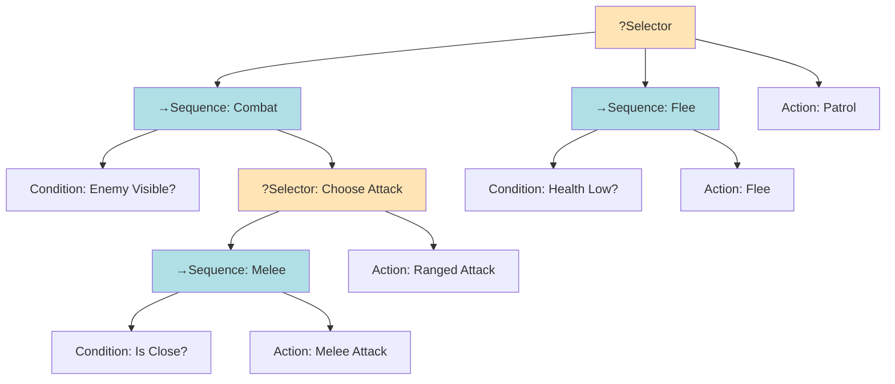

# Behavior Trees (BT)

## Overview

Behavior Trees are a hierarchical, modular way of organizing AI decision-making. Originally developed for game AI, they're now widely used in robotics, autonomous systems, and workflow automation.

Unlike FSMs, Behavior Trees provide better modularity, reusability, and scalability.

## Core Concepts

### Node Types

1. **Composite Nodes**: Have multiple children, control execution flow
2. **Decorator Nodes**: Have one child, modify its behavior
3. **Leaf Nodes**: Perform actions or checks

### Node Return Values

- **Success**: Node completed successfully
- **Failure**: Node failed
- **Running**: Node is still executing

## Node Types in Detail

### 1. Composite Nodes

#### Sequence Node (→)
Executes children left-to-right until one **fails**

```
Sequence
├─ Check Ammo     (Success)
├─ Aim at Target  (Success)
└─ Shoot          (Success/Failure)
```

#### Selector/Fallback Node (?)
Executes children left-to-right until one **succeeds**

```
Selector
├─ Try Melee Attack    (Failure - too far)
├─ Try Ranged Attack   (Success!)
└─ Flee                (not executed)
```

#### Parallel Node (⚡)
Executes all children simultaneously

```
Parallel
├─ Move to Cover
├─ Watch for Enemies
└─ Reload Weapon
```

### 2. Decorator Nodes

- **Inverter**: Flips Success ↔ Failure
- **Repeater**: Repeats child N times or until failure
- **Repeat Until Fail**: Keeps executing until child fails
- **Succeeder**: Always returns Success
- **Retry**: Retries child until success or max attempts

### 3. Leaf Nodes

#### Condition Nodes
Check if something is true/false

```
- IsEnemyVisible?
- IsHealthLow?
- HasAmmo?
```

#### Action Nodes
Perform actual behaviors

```
- Shoot
- Move to position
- Play animation
- Send message
```

## Example: Enemy AI Behavior Tree

### ASCII Representation

```
                    [Selector]
                        │
        ┌───────────────┼───────────────┐
        │               │               │
    [Sequence]      [Sequence]      [Action]
    Is Enemy        Is Health       Patrol
    Visible?        Low?
        │               │
    ┌───┴───┐       ┌───┴───┐
    │       │       │       │
  True  [Selector]  True  [Action]
           │              Flee
      ┌────┼────┐
      │    │    │
 [Sequence] │ [Action]
 Is Close?  │ Ranged
      │     │ Attack
  ┌───┴──┐  │
  │      │  │
True [Action]│
     Melee  │
     Attack │
```

### Mermaid Diagram



## Execution Flow

### Tick-Based Execution

```
1. Root node is "ticked"
2. Root ticks its children in order
3. Each child returns Success/Failure/Running
4. Parent uses return value to decide next step
5. Process continues until root returns a status
```

### Example Execution

```
Tick 1: Sequence [Running]
  ├─ Check Ammo [Success]
  ├─ Aim [Running] ← Still aiming
  └─ Shoot [not reached]

Tick 2: Sequence [Running]
  ├─ Check Ammo [Success] (re-checked)
  ├─ Aim [Success] ← Done aiming
  └─ Shoot [Running] ← Shooting animation

Tick 3: Sequence [Success]
  ├─ Check Ammo [Success]
  ├─ Aim [Success]
  └─ Shoot [Success] ← Completed!
```

## Blackboard Pattern

A shared data structure for storing and accessing state across nodes.

```
Blackboard:
  - enemy_position: Vector3(10, 0, 5)
  - last_known_position: Vector3(8, 0, 4)
  - ammo_count: 15
  - health: 80
```

Nodes can read/write to the blackboard:

```python
# In a condition node
def check():
    health = blackboard.get("health")
    return health < 30

# In an action node
def execute():
    target = blackboard.get("enemy_position")
    move_toward(target)
    blackboard.set("last_position", current_position)
```

## Advantages of Behavior Trees

✅ **Modular**: Easy to add/remove/modify behaviors  
✅ **Reusable**: Subtrees can be reused across agents  
✅ **Scalable**: Handles complex behaviors better than FSM  
✅ **Visual**: Intuitive tree structure  
✅ **Designer-friendly**: Non-programmers can build behaviors  
✅ **Debuggable**: Easy to trace execution path

## Limitations

❌ **Learning curve**: More complex than FSM initially  
❌ **Performance overhead**: More function calls than FSM  
❌ **Can become large**: Deep trees get unwieldy  
❌ **Execution order matters**: Left-to-right can be limiting

## BT vs FSM Comparison

```
FSM:
- State-centric ("What state am I in?")
- Explicit transitions
- Flat or hierarchical
- Good for simple, state-based logic

BT:
- Task-centric ("What should I do?")
- Implicit transitions (via tree traversal)
- Hierarchical by nature
- Good for complex, goal-driven behavior
```

## Real-World Use Cases

### Game AI
- Character behaviors (combat, exploration, dialogue)
- NPC routines and schedules
- Boss fight patterns

### Robotics
- Task planning and execution
- Navigation with obstacle avoidance
- Multi-robot coordination

### Autonomous Systems
- Drone flight control
- Self-driving vehicles
- Warehouse automation

## Best Practices

1. **Keep trees shallow**: Prefer width over depth
2. **Use subtrees**: Modularize common behaviors
3. **Name nodes clearly**: Descriptive names aid debugging
4. **Leverage blackboard**: Share state, don't duplicate
5. **Test incrementally**: Build and test small subtrees first
6. **Document complex logic**: Add comments for intricate flows

## Tools and Libraries

### Game Engines
- **Unreal Engine**: Built-in Behavior Tree editor
- **Unity**: Various BT asset packages
- **Godot**: Community BT plugins

### Libraries
- **BehaviorTree.CPP** (C++)
- **py_trees** (Python)
- **BehaviorTree.js** (JavaScript)
- **bt** (Rust)

