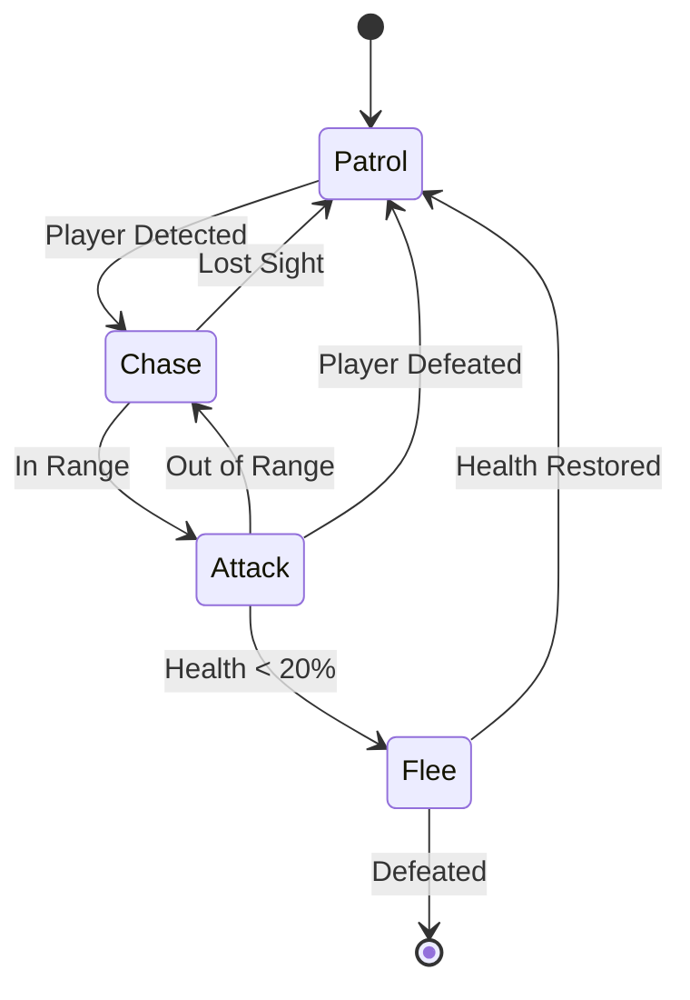

# Finite State Machines (FSM)

## Overview

A Finite State Machine is a computational model consisting of a finite number of states, transitions between those states, and actions. FSMs are widely used in game AI, workflow automation, and control systems.

## Core Concepts

- **State**: A distinct condition or situation the agent can be in
- **Transition**: Movement from one state to another
- **Condition/Event**: Trigger that causes a transition
- **Action**: Behavior executed in a state or during transition

## Basic FSM Structure

```
States = {S1, S2, S3, ...}
Initial State = S0
Transitions = {(State, Event) → Next State}
Actions = {State → Action}
```

## Example: Enemy AI in a Game

### States
- **Patrol**: Walking along a predefined path
- **Chase**: Pursuing the player
- **Attack**: Engaging the player
- **Flee**: Retreating when health is low

### ASCII Diagram

```
                    ┌─────────────┐
           ┌───────>│   PATROL    │<──────┐
           │        └──────┬──────┘       │
           │               │              │
           │   lost sight  │ see player   │ defeated
           │               │              │
           │               v              │
           │        ┌─────────────┐       │
           │        │    CHASE    │       │
           │        └──────┬──────┘       │
           │               │              │
    low    │   out of      │ in range     │
    health │   range       │              │
           │               v              │
           │        ┌─────────────┐       │
           └────────│   ATTACK    │───────┘
                    └─────┬───────┘
                          │
                          │ health < 20%
                          │
                          v
                    ┌─────────────┐
                    │    FLEE     │
                    └─────────────┘
```

### Mermaid Diagram



## FSM Implementation Pattern

### Pseudocode

```python
class State:
    def enter():
        # Called when entering the state
        pass
    
    def execute():
        # Called every update while in this state
        pass
    
    def exit():
        # Called when leaving the state
        pass
    
    def check_transitions():
        # Check if conditions are met to transition
        return next_state or None

class FSM:
    def __init__(self, initial_state):
        self.current_state = initial_state
        self.current_state.enter()
    
    def update():
        # Execute current state logic
        self.current_state.execute()
        
        # Check for state transitions
        next_state = self.current_state.check_transitions()
        
        if next_state:
            self.current_state.exit()
            self.current_state = next_state
            self.current_state.enter()
```

## Hierarchical FSM (HFSM)

Extends basic FSM by allowing states to contain sub-FSMs, enabling more complex behavior.

### ASCII Diagram

```
┌─────────────────────────────────────────────┐
│           COMBAT (Super State)              │
│                                             │
│  ┌─────────────┐         ┌─────────────┐   │
│  │   MELEE     │────────>│   RANGED    │   │
│  │   ATTACK    │         │   ATTACK    │   │
│  └─────────────┘         └─────────────┘   │
│         ^                        │          │
│         └────────────────────────┘          │
└──────────────────┬──────────────────────────┘
                   │
                   │ enemy far
                   │
                   v
            ┌─────────────┐
            │    PATROL    │
            └─────────────┘
```

## Advantages of FSM

✅ **Simple and intuitive**: Easy to understand and implement  
✅ **Predictable**: Behavior is deterministic  
✅ **Efficient**: Low computational overhead  
✅ **Easy to debug**: Clear state visualization  
✅ **Well-tested**: Proven technique with decades of use

## Limitations of FSM

❌ **State explosion**: Complex behaviors require many states  
❌ **Rigid structure**: Difficult to add new behaviors  
❌ **Poor scalability**: Becomes unwieldy with many transitions  
❌ **Lack of modularity**: Hard to reuse components  
❌ **No memory**: Doesn't remember which states were visited (unless extended)

## When to Use FSM

**Good for:**
- Simple, well-defined behaviors
- UI navigation and menu systems
- Protocol state machines
- Game character controllers
- Workflow automation

**Consider alternatives for:**
- Complex, adaptive AI
- Large number of states (>20-30)
- Behaviors requiring extensive memory
- Highly dynamic environments

## FSM vs Other Architectures

| Feature | FSM | Behavior Trees | GOAP |
|---------|-----|----------------|------|
| Complexity | Low | Medium | High |
| Flexibility | Low | Medium | High |
| Modularity | Low | High | Medium |
| Scalability | Poor | Good | Good |
| Learning | No | Limited | Yes |
| Performance | Excellent | Good | Fair |

## Extended FSM Variants

### 1. Stack-Based FSM
- Maintains a stack of states
- Can push/pop states (e.g., interrupts)
- Better for hierarchical behaviors

### 2. Pushdown Automaton
- FSM + stack memory
- Can remember context
- More powerful but more complex

### 3. Fuzzy State Machine
- States have degrees of membership (0-1)
- Can be in multiple states simultaneously
- Smoother transitions

