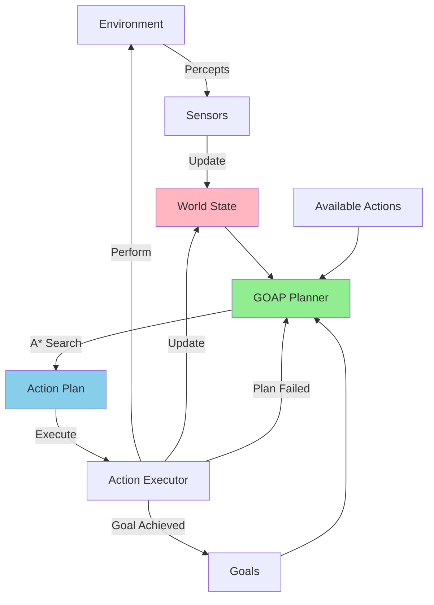

# Goal-Oriented Action Planning (GOAP)

## Overview

GOAP is an AI planning architecture that allows agents to dynamically create plans to achieve goals. Unlike FSMs and Behavior Trees, GOAP agents build action sequences at runtime based on the current world state and desired goals.

Developed by Jeff Orkin for F.E.A.R. (2005), GOAP has become popular for creating flexible, adaptive AI.

## Core Concepts

### World State
A set of key-value pairs representing the current state of the world.

```python
world_state = {
    "has_weapon": False,
    "weapon_loaded": False,
    "enemy_visible": True,
    "at_cover": False,
    "health_low": False
}
```

### Goals
Desired world states the agent wants to achieve.

```python
goal = {
    "enemy_dead": True
}
```

### Actions
Operations that can change the world state.

```python
Action: "Shoot Enemy"
  Preconditions:
    - has_weapon: True
    - weapon_loaded: True
    - enemy_visible: True
  Effects:
    - enemy_dead: True
    - weapon_loaded: False
  Cost: 5
```

## GOAP Architecture

### ASCII Diagram

```
┌─────────────────────────────────-────────────────────────┐
│                    GOAP Agent                            │
│                                                          │
│  ┌──────────────┐         ┌─0─────────────┐              │
│  │   Sensors    │────────>│ World State   │              │
│  └──────────────┘         └──-────┬───────┘              │
│                                   │                      │
│  ┌──────────────┐                 │                      │
│  │  Goals       │                 │                      │
│  │  - Priority  │                 │                      │
│  │  - Relevance │                 │                      │
│  └──────┬───────┘                 │                      │
│         │                         │                      │
│         └────────────┬────────────┘                      │
│                      │                                   │
│                      v                                   │
│            ┌─────────────────┐                           │
│            │  GOAP Planner   │                           │
│            │  (A* Search)    │                           │
│            └────────┬────────┘                           │
│                     │                                    │
│                     │ generates                          │
│                     │                                    │
│                     v                                    │
│            ┌─────────────────┐                           │
│            │   Action Plan   │                           │
│            │ [A1, A2, A3...] │                           │
│            └────────┬────────┘                           │
│                     │                                    │
│                     v                                    │
│            ┌─────────────────┐                           │
│            │  Execute Action │                           │
│            └────────┬────────┘                           │
└─────────────────────┼────────────────────────────────────┘
                      │
                      v
                ┌───────────┐
                │Environment│
                └───────────┘
```

### Mermaid Diagram



## Planning Algorithm (A* Search)

GOAP uses A* pathfinding to find the sequence of actions from the current state to the goal state.

### Planning Process

```
1. Start with Current World State
2. Set Goal State
3. Build action graph:
   - Each node = a possible world state
   - Each edge = an action
4. Find lowest-cost path from current to goal
5. Execute actions in sequence
```

### ASCII Planning Graph

```
Current State          Action Graph              Goal State
┌──────────────┐                             ┌──────────────┐
│ has_weapon: F│                             │ enemy_dead: T│
│ enemy_vis: T │                             └──────────────┘
└──────┬───────┘                                     ^
       │                                             │
       │ Pickup Weapon (cost: 3)                    │
       │                                             │
       v                                             │
┌──────────────┐                                    │
│ has_weapon: T│                                    │
│ weapon_load:F│                                    │
└──────┬───────┘                                    │
       │                                             │
       │ Load Weapon (cost: 2)                      │
       │                                             │
       v                                             │
┌──────────────┐                                    │
│ has_weapon: T│                                    │
│ weapon_load:T│                                    │
└──────┬───────┘                                    │
       │                                             │
       │ Shoot Enemy (cost: 5)                      │
       │                                             │
       └─────────────────────────────────────────────┘

Total Cost: 3 + 2 + 5 = 10
```

## Example: Military AI

### World State

```python
{
    "has_weapon": False,
    "weapon_loaded": False,
    "at_cover": False,
    "enemy_visible": True,
    "enemy_dead": False,
    "ammo_available": True
}
```

### Available Actions

```python
Action: "Get Weapon"
  Preconditions: {}
  Effects: { "has_weapon": True }
  Cost: 3

Action: "Load Weapon"
  Preconditions: { "has_weapon": True, "ammo_available": True }
  Effects: { "weapon_loaded": True }
  Cost: 2

Action: "Take Cover"
  Preconditions: {}
  Effects: { "at_cover": True }
  Cost: 4

Action: "Shoot Enemy"
  Preconditions: {
    "has_weapon": True,
    "weapon_loaded": True,
    "enemy_visible": True
  }
  Effects: {
    "enemy_dead": True,
    "weapon_loaded": False
  }
  Cost: 5

Action: "Search for Enemy"
  Preconditions: {}
  Effects: { "enemy_visible": True }
  Cost: 6
```

### Goal

```python
{ "enemy_dead": True }
```

### Resulting Plan

```
1. Get Weapon (cost: 3)
2. Load Weapon (cost: 2)
3. Shoot Enemy (cost: 5)

Total Cost: 10
```

## Dynamic Replanning

One of GOAP's key strengths is adapting to changing situations.

```
Original Plan:
  1. Get Weapon
  2. Load Weapon
  3. Shoot Enemy

World State Changes:
  - enemy_visible: False (enemy moved!)

Replanning triggered:
  1. Search for Enemy (cost: 6)
  2. Shoot Enemy (cost: 5)

New total cost: 11
```

## Advantages of GOAP

✅ **Dynamic planning**: Adapts to changing circumstances  
✅ **Goal-oriented**: Focuses on what to achieve, not how  
✅ **Emergent behavior**: Complex behaviors from simple actions  
✅ **Flexible**: Easy to add new actions and goals  
✅ **Realistic**: Creates believable AI behavior  
✅ **Modular**: Actions are independent and reusable

## Limitations

❌ **Computational cost**: Planning can be expensive (O(n) actions)  
❌ **No learning**: Doesn't improve from experience (without extensions)  
❌ **Predictable over time**: Uses same costs and heuristics  
❌ **Setup overhead**: Requires careful action design  
❌ **May need tuning**: Action costs affect behavior significantly

## GOAP vs Other Architectures

```
FSM:
- Predefined transitions
- Fast execution
- Limited flexibility

Behavior Trees:
- Hierarchical task decomposition
- Moderate flexibility
- No runtime planning

GOAP:
- Runtime planning
- High flexibility
- More CPU intensive
- Emergent behavior
```

## Advanced GOAP Concepts

### Multiple Goals with Priorities

```python
goals = [
    {"state": {"enemy_dead": True}, "priority": 10},
    {"state": {"health_high": True}, "priority": 8},
    {"state": {"ammo_stocked": True}, "priority": 5}
]
```

Agent selects highest priority achievable goal.

### Context-Aware Action Costs

```python
def get_shoot_cost(world_state):
    if world_state["at_cover"]:
        return 5  # Safe to shoot
    else:
        return 15  # Dangerous, increase cost
```

### Conditional Effects

```python
Action: "Shoot Enemy"
  Preconditions: {...}
  Effects:
    If accuracy_high:
      - enemy_dead: True
    Else:
      - enemy_alerted: True
```

## Implementation Tips

1. **Keep actions atomic**: Each action should do one thing
2. **Design clear preconditions**: Avoid ambiguous states
3. **Balance action costs**: Costs dramatically affect behavior
4. **Cache plans**: Don't replan every frame
5. **Set replanning triggers**: Only replan when world state changes significantly
6. **Profile performance**: Monitor planning time in production

## Real-World Applications

### Games
- F.E.A.R. (2005) - Original implementation
- Fallout 3 / Skyrim - NPC behaviors
- Shadow of Mordor - Nemesis System elements

### Simulation
- Military training simulations
- Urban planning simulations
- Economic modeling

### Robotics
- Task planning for service robots
- Multi-robot coordination
- Adaptive manufacturing systems

## GOAP Extensions

### HTN (Hierarchical Task Network)
Combines GOAP with hierarchical decomposition for even more complex planning.

### GOAP + Learning
Integrate reinforcement learning to adjust action costs based on success/failure.

### Utility-Based GOAP
Incorporate utility theory for more nuanced goal selection.

