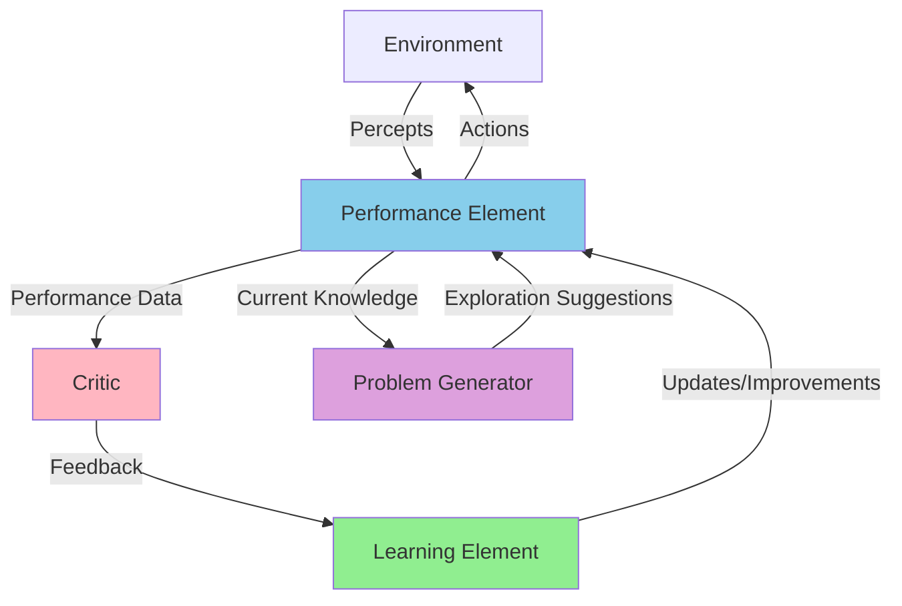

# Learning Agents

## Overview

Learning agents are advanced AI systems that can improve their performance over time through experience. Unlike reflex agents, they can adapt to changing environments and optimize their behavior based on feedback.

## Architecture

A learning agent consists of four main components:

1. **Learning Element**: Improves the agent's performance
2. **Performance Element**: Selects actions (the "current brain")
3. **Critic**: Provides feedback on agent's performance
4. **Problem Generator**: Suggests exploratory actions

### ASCII Diagram

```
┌────────────────────────────────────────────────────────────┐
│                      Learning Agent                         │
│                                                             │
│  ┌─────────────┐         ┌──────────────────┐             │
│  │   Critic    │         │    Learning      │             │
│  │             │─feedback─>    Element      │             │
│  └──────┬──────┘         └─────────┬────────┘             │
│         │                          │                       │
│         │                          │ improvements          │
│         │                          │                       │
│         │                          v                       │
│  ┌──────┴──────────────────────────────────┐              │
│  │         Performance Element              │              │
│  │      (Action Selection & Execution)      │              │
│  └──────┬────────────────────────────┬──────┘              │
│         │                            │                     │
│         │                            │ exploratory         │
│         │                    ┌───────┴────────┐            │
│         │                    │   Problem      │            │
│         │                    │   Generator    │            │
│         │                    └────────────────┘            │
│         │                                                  │
└─────────┼──────────────────────────────────────────────────┘
          │
          v
    ┌──────────────┐
    │ Environment  │
    │  (Actions &  │
    │   Percepts)  │
    └──────────────┘
```

### Mermaid Diagram



## Learning Types

### 1. Supervised Learning
- Learns from labeled training examples
- Agent is told the "correct" action for each state

### 2. Unsupervised Learning
- Discovers patterns without explicit feedback
- Finds structure in unlabeled data

### 3. Reinforcement Learning
- Learns through trial and error
- Receives rewards or penalties for actions
- **Most relevant for autonomous agents**

## Reinforcement Learning Process

```
Agent observes State (S)
  ↓
Takes Action (A)
  ↓
Environment transitions to new State (S')
  ↓
Agent receives Reward (R)
  ↓
Agent updates its policy to maximize future rewards
  ↓
Repeat
```

### ASCII Flow

```
    ┌─────────────────────────────────────────┐
    │                                         │
    │          RL Feedback Loop               │
    │                                         │
    v                                         │
┌───────┐    action    ┌─────────────┐       │
│ Agent │─────────────>│ Environment │       │
└───┬───┘              └──────┬──────┘       │
    ^                         │              │
    │                         │              │
    │   state + reward        │              │
    └─────────────────────────┘──────────────┘
```

## Comparison: Reflex vs Learning Agents

| Aspect | Reflex Agent | Learning Agent |
|--------|--------------|----------------|
| Memory | No history | Maintains experience |
| Adaptation | Fixed rules | Learns from feedback |
| Performance | Constant | Improves over time |
| Complexity | Low | High |
| Resource Use | Minimal | Significant |
| Flexibility | Limited | High |

## Learning Approaches for Agents

### Finite State Machines (FSM)
- States and transitions can be learned
- Simple but limited expressiveness

### Behavior Trees
- Can learn which behaviors to select
- More modular than FSMs

### GOAP (Goal-Oriented Action Planning)
- Can learn action costs and preconditions
- More flexible planning

### Neural Networks / Deep Learning
- Can learn complex patterns
- Black box - less interpretable
- Requires significant training data

## Use Cases

**Learning agents excel at:**
- Dynamic, changing environments
- Complex decision-making scenarios
- Tasks with delayed rewards
- Situations where optimal behavior is unknown upfront
- Personalization and adaptation to user behavior

**Examples:**
- Game AI that adapts to player strategies
- Recommendation systems
- Autonomous vehicles
- Trading algorithms
- Chatbots that improve from conversations

