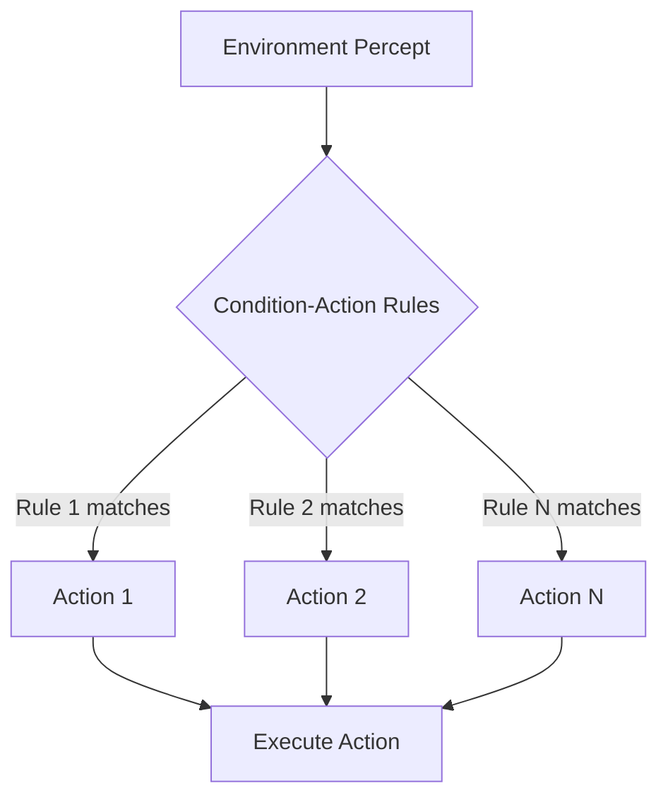

# Reflex Agents

## Overview

Reflex agents are the simplest type of AI agents that make decisions based solely on the current percept (observation) without considering the history of past states or future consequences.

## Simple Reflex Agent

### Characteristics

- **Stateless**: No memory of past percepts
- **Rule-based**: Uses condition-action rules (if-then statements)
- **Fast**: Minimal processing overhead
- **Limited**: Cannot handle partially observable environments

### Structure

```
Current Percept → Condition-Action Rules → Action
```

### Example: Thermostat

A thermostat is a classic example of a simple reflex agent:

**Rules:**
- IF temperature < 20°C THEN turn heating ON
- IF temperature > 22°C THEN turn heating OFF

**ASCII Diagram:**

```
┌─────────────┐
│ Temperature │
│   Sensor    │
└──────┬──────┘
       │
       v
┌─────────────────────────┐
│  Condition-Action Rule  │
│                         │
│  IF temp < 20°C         │
│    THEN heat = ON       │
│  IF temp > 22°C         │
│    THEN heat = OFF      │
└──────────┬──────────────┘
           │
           v
    ┌──────────┐
    │  Heater  │
    └──────────┘
```

### Mermaid Diagram



## Model-Based Reflex Agent

### Characteristics

- **Maintains internal state**: Tracks aspects of environment not directly observable
- **More flexible**: Can handle partially observable environments
- **Uses world model**: Understands how the world evolves

### Structure

```
Current Percept + Internal State → Update State → Condition-Action Rules → Action
```

### ASCII Diagram

```
┌──────────────────┐
│    Environment   │
└─────────┬────────┘
          │
          v
    ┌─────────┐          ┌───────────────┐
    │ Sensors │─────────>│ Internal      │
    └─────────┘          │ State Model   │
                         │               │
                         │ - Current     │
                         │   Percept     │
                         │ - History     │
                         │ - World Model │
                         └───────┬───────┘
                                 │
                                 v
                         ┌───────────────┐
                         │ Rule Matching │
                         │ & Selection   │
                         └───────┬───────┘
                                 │
                                 v
                          ┌──────────┐
                          │ Actuators│
                          └────┬─────┘
                               │
                               v
                         ┌──────────┐
                         │ Environment│
                         └──────────┘
```

## Limitations of Reflex Agents

1. **No planning**: Cannot reason about future consequences
2. **No learning**: Cannot improve from experience
3. **Limited adaptability**: Rules must be predefined
4. **Context insensitive**: May fail in complex, dynamic environments

## Use Cases

**Good for:**
- Real-time systems with clear rules (thermostats, automatic doors)
- Simple automation tasks
- Resource-constrained environments
- Time-critical responses

**Not suitable for:**
- Complex decision-making
- Environments requiring long-term planning
- Tasks requiring learning and adaptation

