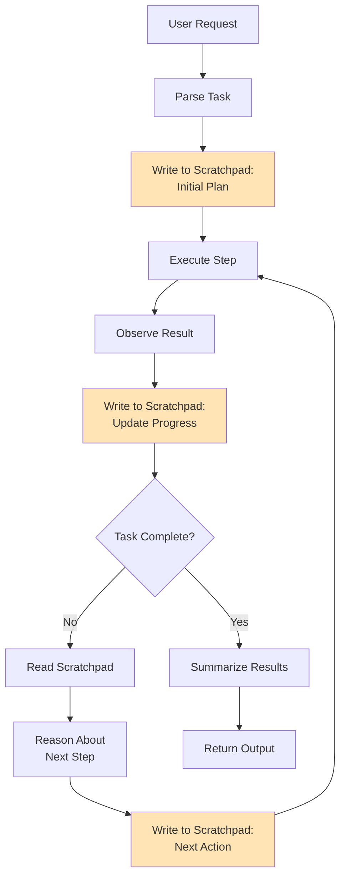

# Scratchpad Pattern for Autonomous Agents

## Overview

The scratchpad pattern is a technique used in autonomous AI systems to provide agents with working memory for reasoning, planning, and executing complex tasks. It acts as a temporary workspace where the agent can write thoughts, break down problems, and track intermediate steps.

## Core Concept

```
Agent → Writes thoughts to scratchpad → Reads from scratchpad → Takes action → Updates scratchpad
```

The scratchpad serves as:
- **External memory**: Store information beyond token limits
- **Reasoning workspace**: Break down complex problems
- **Execution tracker**: Monitor progress through multi-step tasks
- **Context carrier**: Maintain state across conversation turns

## Architecture

### ASCII Diagram

```
┌─────────────────────────────────────────────────────────┐
│                  Autonomous Agent                       │
│                                                         │
│  ┌────────────┐                    ┌────────────┐      │
│  │   Input    │                    │  Output    │      │
│  │ (Task/Goal)│                    │ (Actions)  │      │
│  └──────┬─────┘                    └─────▲──────┘      │
│         │                                 │             │
│         v                                 │             │
│  ┌─────────────────────────────────────────────┐       │
│  │          Reasoning Engine                   │       │
│  │    ┌──────────────────────────────┐         │       │
│  │    │    Scratchpad Memory         │         │       │
│  │    │  ┌────────────────────────┐  │         │       │
│  │    │  │ Current Task           │  │         │       │
│  │    │  │ - Goal: X              │  │         │       │
│  │    │  │ - Plan: [A, B, C]      │  │         │       │
│  │    │  │ - Progress: Step 2/3   │  │         │       │
│  │    │  └────────────────────────┘  │         │       │
│  │    │  ┌────────────────────────┐  │         │       │
│  │    │  │ Observations           │  │         │       │
│  │    │  │ - Fact 1               │  │         │       │
│  │    │  │ - Fact 2               │  │         │       │
│  │    │  └────────────────────────┘  │         │       │
│  │    │  ┌────────────────────────┐  │         │       │
│  │    │  │ Intermediate Results   │  │         │       │
│  │    │  │ - Result A: ...        │  │         │       │
│  │    │  └────────────────────────┘  │         │       │
│  │    └──────────────────────────────┘         │       │
│  └─────────────────────────────────────────────┘       │
└─────────────────────────────────────────────────────────┘
```

## Scratchpad Components

### 1. Task Decomposition Section

```
Task: "Create a REST API for a todo application"

Decomposition:
1. Design database schema
2. Set up project structure
3. Implement CRUD endpoints
4. Add authentication
5. Write tests
6. Deploy
```

### 2. Reasoning Traces

```
Thought: I need to choose a database. Let me consider options:
- PostgreSQL: Good for relational data, mature
- MongoDB: Flexible schema, but task seems relational
- SQLite: Simple, good for development

Decision: PostgreSQL - todos have clear structure (id, title, done, user_id)
```

### 3. Progress Tracking

```
Progress:
✅ 1. Design database schema
✅ 2. Set up project structure
🔄 3. Implement CRUD endpoints (in progress)
   ✅ - GET /todos
   ✅ - POST /todos
   🔄 - PUT /todos/:id (working on this)
   ⏸️  - DELETE /todos/:id (pending)
⏸️  4. Add authentication
⏸️  5. Write tests
⏸️  6. Deploy
```

### 4. Context and State

```
Context:
- Language: Python
- Framework: FastAPI
- Database: PostgreSQL
- Current File: api/routes.py
- Last Error: None

State:
- Phase: Implementation
- Confidence: High
- Blockers: None
```

## Scratchpad Workflow

### Mermaid Diagram



## Implementation Patterns

### Pattern 1: Chain of Thought (CoT)

```
Scratchpad:

Question: What is 15% of 240?

Reasoning:
1. Convert percentage to decimal: 15% = 0.15
2. Multiply: 240 × 0.15
3. Calculate: 36

Answer: 36
```

### Pattern 2: ReAct (Reasoning + Acting)

```
Scratchpad:

Task: Find the population of the capital of France

Thought 1: I need to identify the capital of France first
Action 1: search("capital of France")
Observation 1: The capital of France is Paris

Thought 2: Now I need to find the population of Paris
Action 2: search("population of Paris 2024")
Observation 2: Paris has approximately 2.1 million inhabitants

Answer: The capital of France is Paris with a population of ~2.1 million
```

### Pattern 3: Reflexion (Self-Reflection)

```
Scratchpad:

Attempt 1:
Action: Write code without tests
Result: Code has bugs
Reflection: I should have written tests first. TDD would help catch issues early.

Attempt 2:
Action: Write tests first, then implementation
Result: Code passes all tests
Reflection: TDD approach worked well. Will use this pattern going forward.
```

## Benefits of Scratchpad Pattern

✅ **Transparency**: Makes reasoning visible and debuggable  
✅ **Improved accuracy**: Breaking down problems reduces errors  
✅ **Context preservation**: Maintains state across interactions  
✅ **Error recovery**: Can review and learn from failures  
✅ **Iterative refinement**: Can revise and improve plans  
✅ **Auditability**: Clear trace of decision-making process

## Memory and Feedback Cycles

### Short-Term Memory (Scratchpad)
- Active for current task
- Cleared after task completion
- High read/write frequency

### Long-Term Memory (Knowledge Base)
- Persistent across tasks
- Stores learned patterns and facts
- Updated periodically

### Feedback Loop

```
┌─────────────────────────────────────────────────┐
│                                                 │
│  Action → Environment → Observation → Feedback  │
│     ▲                                      │    │
│     │                                      v    │
│     └───────── Update Scratchpad ─────────┘    │
│                       │                         │
│                       v                         │
│            Learn from Experience                │
│                       │                         │
│                       v                         │
│          Update Long-Term Memory                │
│                                                 │
└─────────────────────────────────────────────────┘
```

## Advanced Scratchpad Techniques

### 1. Hierarchical Scratchpads

```
Main Scratchpad:
  Task: Build web application
  Plan: [Backend, Frontend, Deploy]
  Current: Backend
    ↓
Backend Scratchpad:
  Task: Build REST API
  Plan: [Routes, Database, Auth]
  Current: Routes
    ↓
Routes Scratchpad:
  Task: Implement CRUD operations
  Plan: [GET, POST, PUT, DELETE]
  Current: POST
```

### 2. Multi-Agent Scratchpads

```
Shared Scratchpad:
  Project: E-commerce Platform
  
Agent 1 (Backend Dev) Scratchpad:
  - Working on: Payment API
  - Status: Testing
  - Blockers: Need frontend integration
  
Agent 2 (Frontend Dev) Scratchpad:
  - Working on: Checkout UI
  - Status: Ready for integration
  - Dependencies: Payment API endpoint

Coordinator reads both and orchestrates handoff
```

### 3. Episodic Memory Integration

```
Scratchpad:

Current Task: Debug authentication issue

Retrieving from episodic memory...
  Similar Issue (2 weeks ago):
    - Problem: JWT token expiration
    - Solution: Increased token lifetime
    - Outcome: Fixed
  
Applying learned solution...
  Checking token configuration...
  Found: Same issue!
  Applying fix...
```

## Implementation Considerations

### Storage Options

1. **In-Context**: Within LLM context window
   - Pros: Fast, no external dependencies
   - Cons: Token limits, expensive

2. **Key-Value Store** (Redis, DynamoDB)
   - Pros: Fast, structured
   - Cons: Requires infrastructure

3. **Vector Database** (Pinecone, Weaviate)
   - Pros: Semantic retrieval
   - Cons: More complex setup

4. **File System**
   - Pros: Simple, persistent
   - Cons: Slower, less structured

### Best Practices

1. **Structure your scratchpad**: Use clear sections and formatting
2. **Limit scope**: Don't store everything, focus on relevant info
3. **Regular cleanup**: Prune old or irrelevant entries
4. **Version control**: Track changes to reasoning over time
5. **Error handling**: Include failure modes and recovery strategies
6. **Prioritization**: Mark critical vs. optional information

## Use Cases

### Software Development
```
Scratchpad:
- Requirements analysis
- Architecture decisions
- Implementation tracking
- Test results
- Deployment checklist
```

### Research and Analysis
```
Scratchpad:
- Research questions
- Sources consulted
- Key findings
- Synthesis of information
- Conclusions
```

### Task Automation
```
Scratchpad:
- Task queue
- Current step
- Dependencies resolved
- Errors encountered
- Retry strategies
```

## Scratchpad + Learning Agent

Combining scratchpad with learning creates powerful autonomous systems:

```
Scratchpad → Execution → Feedback → Reflection → Learning
     ↑                                              │
     └──────────── Update Strategy ─────────────────┘
```

Example:

```
Iteration 1:
  Strategy: Brute force search
  Result: Slow (10s)
  Reflection: Need better approach
  
Iteration 2:
  Strategy: Binary search (learned from reflection)
  Result: Fast (0.1s)
  Reflection: Much better, will use this pattern
  
Stored in long-term memory:
  Pattern: "For sorted data, use binary search"
```

## Tools and Frameworks

### LangChain Agents
- Built-in agent scratchpad
- Tool execution tracking
- Memory management

### AutoGPT / BabyAGI
- Task decomposition in scratchpad
- Goal tracking
- Recursive task execution

### Custom Implementation
```python
class Scratchpad:
    def __init__(self):
        self.thoughts = []
        self.actions = []
        self.observations = []
    
    def add_thought(self, thought):
        self.thoughts.append(thought)
    
    def add_action(self, action):
        self.actions.append(action)
    
    def add_observation(self, obs):
        self.observations.append(obs)
    
    def get_context(self):
        return {
            "thoughts": self.thoughts,
            "actions": self.actions,
            "observations": self.observations
        }
```

