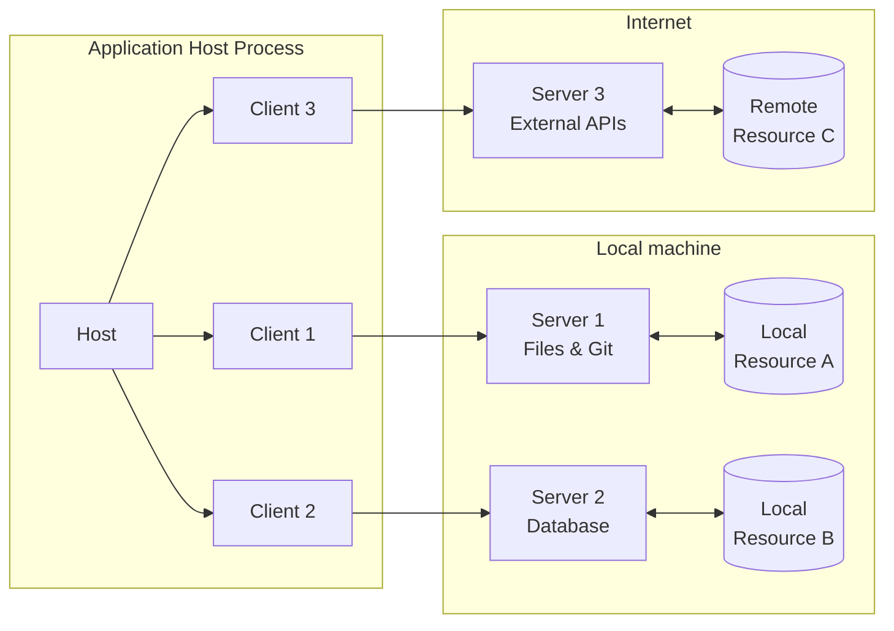
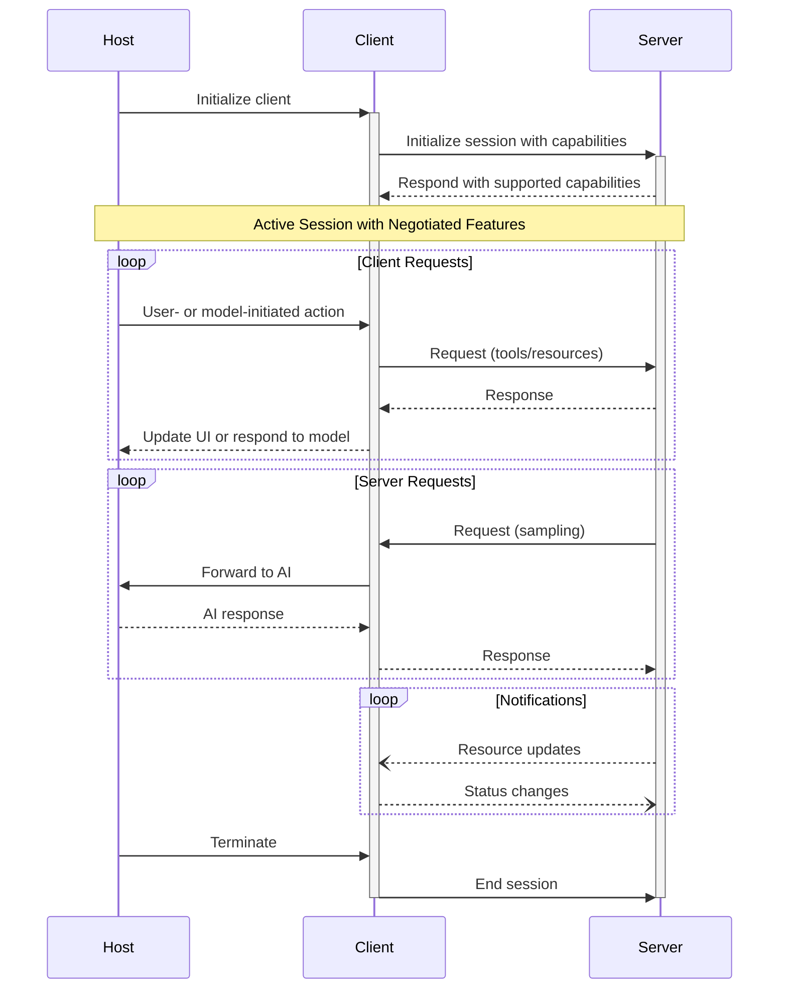

# MCP Architecture

Source: https://github.com/modelcontextprotocol/specification/blob/main/docs/specification/2025-06-18/architecture/index.mdx

## Core Components

The Model Context Protocol follows a client-host-server architecture where each host can run multiple client instances.

### Architecture Diagram (Mermaid)

### Host Responsibilities

- Creates and manages multiple client instances
- Controls client connection permissions and lifecycle
- Enforces security policies and consent requirements
- Handles user authorization decisions
- Coordinates AI/LLM integration and sampling
- Manages context aggregation across clients

### Client Responsibilities

- Establishes one stateful session per server
- Handles protocol negotiation and capability exchange
- Routes protocol messages bidirectionally
- Manages subscriptions and notifications
- Maintains security boundaries between servers

### Server Responsibilities

- Expose resources, tools and prompts via MCP primitives
- Operate independently with focused responsibilities
- Request sampling through client interfaces
- Must respect security constraints
- Can be local processes or remote services

## Capability Negotiation

MCP uses capability-based negotiation where clients and servers explicitly declare supported features during initialization.

### Negotiation Flow (Mermaid)

## Design Principles

1. **Easy to Build**: Host applications handle complex orchestration, servers focus on specific capabilities
2. **Highly Composable**: Each server provides focused functionality in isolation
3. **Isolation**: Servers cannot read full conversations or see into other servers
4. **Progressive Enhancement**: Features can be added progressively with backward compatibility

