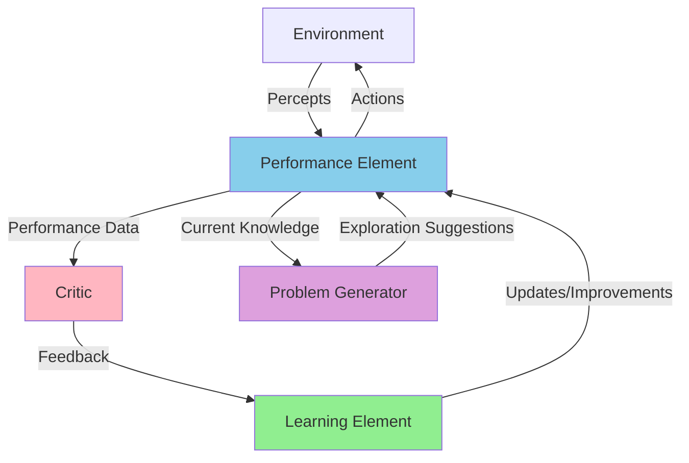
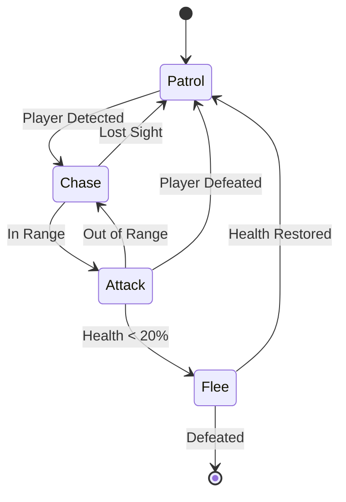
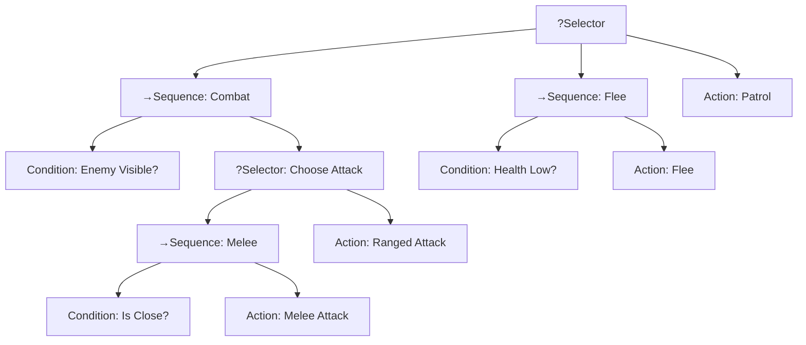
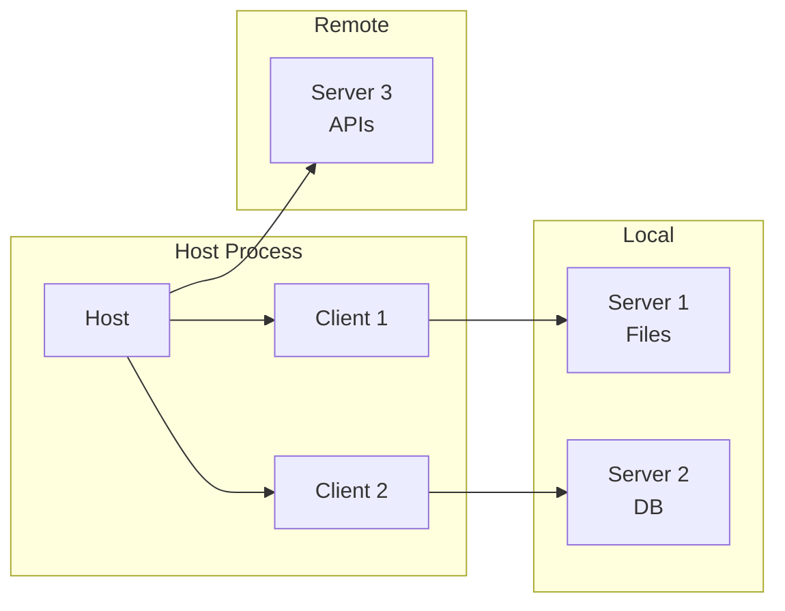
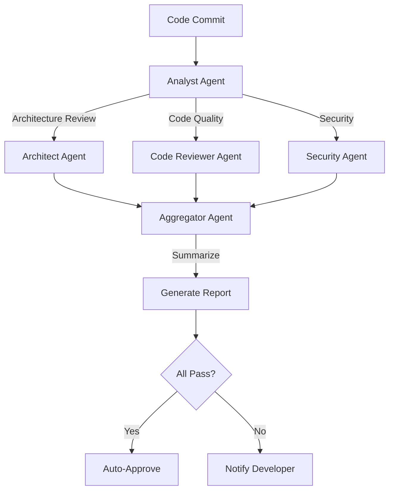

# Autonomous Development Workflows

**Building AI Systems That Code Independently**

---

## About This Talk

**Goal**: Learn how to create work environments where LLMs autonomously complete programming tasks

**What We'll Cover**:
- Autonomous workflow environments and architectures
- Agent types and decision-making patterns
- What works (and what doesn't) in production
- Available frameworks and tools
- Real-world implementation patterns

**Target Audience**: Developers building autonomous coding flows

---

## Three Deployment Environments

### 1. Local (CLI-Based)
- Shell scripts, command-line tools
- Direct developer interaction
- Fast iteration, full control

### 2. Remote (Single Agent)
- Web UI with one running agent
- Centralized execution
- User-initiated workflows

### 3. Distributed Remote
- Multi-agent coordination
- Scheduling and task distribution
- Production-scale autonomous systems

---

## What is a Workflow?

**Workflow**: A sequence of steps to accomplish a task

```
Input → Process → Transform → Action → Output
```

**Examples**:
- CI/CD pipeline: Code → Test → Build → Deploy
- Data processing: Extract → Transform → Load
- Code review: Submit → Analyze → Review → Merge

---

## What is an Autonomous Workflow?

**Autonomous Workflow** (Agentic Workflow): A system that makes decisions and takes actions without human intervention

**Key Characteristics**:
- Self-directed decision making
- Adaptive to changing conditions
- Continuous execution without supervision
- Learn from outcomes (in advanced systems)

---

## Agent Types: Overview

Two fundamental categories:

1. **Reflex Agents**
   - React to current input only
   - No memory of past states
   - Fast, simple, predictable

2. **Learning Agents**
   - Improve from experience
   - Maintain state and memory
   - Adapt behavior over time

---

## Reflex Agent: The Thermostat

**Simple Rule-Based System**

```
┌─────────────┐
│ Temperature │
│   Sensor    │
└──────┬──────┘
       │
       v
┌─────────────────────────┐
│  Condition-Action Rule  │
│                         │
│  IF temp < 20°C         │
│    THEN heat = ON       │
│  IF temp > 22°C         │
│    THEN heat = OFF      │
└──────────┬──────────────┘
           │
           v
    ┌──────────┐
    │  Heater  │
    └──────────┘
```

**Pattern**: Trigger → Action

---

## Reflex Agent: Characteristics

**Advantages**:
✅ Fast response time
✅ Low computational cost
✅ Predictable behavior
✅ Easy to understand and debug

**Limitations**:
❌ No planning capability
❌ Cannot learn from experience
❌ Limited to predefined rules
❌ Fails in complex environments

---

## Learning Agent: Architecture



---

## Learning Agent: Components

**Four Key Elements**:

1. **Performance Element**: Selects actions (the "brain")
2. **Learning Element**: Improves performance over time
3. **Critic**: Provides feedback on actions
4. **Problem Generator**: Suggests exploratory actions

**Key Insight**: Agent improves through experience

---

## Finite State Machines (FSM)

**State-Based Decision Making**



**Use Case**: Game AI, state machines, simple workflows

---

## Behavior Trees (BT)

**Hierarchical Task Decomposition**



---

## GOAP: Goal-Oriented Action Planning

**Dynamic Runtime Planning**

```
Current State          Plan (A* Search)        Goal State
┌──────────────┐                          ┌──────────────┐
│ has_weapon: F│                          │ enemy_dead: T│
└──────┬───────┘                          └──────────────┘
       │ Get Weapon (cost: 3)                     ▲
       v                                          │
┌──────────────┐                                 │
│ has_weapon: T│                                 │
│ weapon_load:F│                                 │
└──────┬───────┘                                 │
       │ Load Weapon (cost: 2)                   │
       v                                          │
┌──────────────┐                                 │
│ has_weapon: T│                                 │
│ weapon_load:T│                                 │
└──────┬───────┘                                 │
       │ Shoot Enemy (cost: 5)                   │
       └─────────────────────────────────────────┘
```

**Total Cost**: 10 (3 + 2 + 5)

---

## Architecture Comparison

| Feature | FSM | Behavior Trees | GOAP | Learning |
|---------|-----|----------------|------|----------|
| Complexity | Low | Medium | High | Very High |
| Flexibility | Low | Medium | High | Highest |
| Adaptability | None | Limited | Medium | Full |
| Performance | Excellent | Good | Fair | Varies |
| Scalability | Poor | Good | Good | Excellent |
| Implementation | Easy | Moderate | Hard | Very Hard |

**Focus for Autonomous Systems**: Learning agents with planning capabilities

---

## Memory and Feedback Cycles

**Critical for Learning**

```
┌─────────────────────────────────────────────────┐
│                                                 │
│  Action → Environment → Observation → Feedback  │
│     ▲                                      │    │
│     │                                      v    │
│     └───────── Update Memory ──────────────┘    │
│                       │                         │
│                       v                         │
│            Learn from Experience                │
│                       │                         │
│                       v                         │
│          Update Long-Term Knowledge             │
│                                                 │
└─────────────────────────────────────────────────┘
```

**Key Insight**: Memory enables context-aware decision making

---

## Model Context Protocol (MCP)

**Standardized Tool and Resource Definition**

### Core Concepts:
- **Resources**: Context and data for AI models
- **Tools**: Functions AI can execute
- **Prompts**: Templated workflows
- **Annotations**: Metadata for behavior

### Benefits:
- Standardized interface
- Easy tool integration
- Clear capability negotiation
- Secure access control

---

## MCP Architecture



**Pattern**: Host manages multiple clients, each connected to specialized servers

---

## What Works in Production

✅ **Separate Planning Agent**
- Dedicated agent for task decomposition
- Clearer reasoning traces
- Better error recovery

✅ **Separate Information Gathering**
- Focused research/search agents
- Parallel information collection
- Reduced context pollution

---

## What Works: Control Flows

✅ **Continuous Workflows with Scheduling**
- **Queue**: Sequential task processing
- **Stack**: Depth-first execution (interrupts)
- **Async**: Parallel agent coordination with semaphores

✅ **Adaptive Patterns**
- JSON-RPC 2.0 for structured communication
- STDIO for process communication
- Event-driven architectures

---

## What Works: Tool Design

✅ **Annotation-Based Descriptions**

```typescript
const tool = {
  name: "search_web",
  description: "Search the web for information",
  parameters: {
    query: { type: "string", description: "Search query" }
  },
  annotations: {
    audience: ["assistant"],
    priority: 0.8,
    category: "research"
  }
}
```

**Benefits**: Clear metadata, better tool selection, priority handling

---

## What Works: Resource Visibility

✅ **Priority and Scoping**

```typescript
resource: {
  uri: "file:///project/README.md",
  annotations: {
    audience: ["user", "assistant"],
    priority: 0.9,  // 0.0-1.0 (1 = required)
    scope: "public"
  }
}
```

**Key Insight**: Annotations help agents choose the right resources

---

## What Works: Advanced Patterns

✅ **Enriched Reasoning**
- Chain-of-Thought prompting
- Self-reflection and critique
- Multi-step reasoning traces

✅ **Custom Control Flows**
- Not relying solely on native tool calling
- Custom execution loops
- State machine orchestration

✅ **Scratchpad Pattern**
- External working memory
- Reasoning workspace
- Progress tracking

---

## Scratchpad Pattern

**Working Memory for Complex Tasks**

```
┌─────────────────────────────────────────────────────┐
│                  Scratchpad Memory                  │
│  ┌────────────────────────────────────────────┐    │
│  │ Current Task: Build REST API               │    │
│  │ Plan: [Design, Implement, Test, Deploy]    │    │
│  │ Progress: Step 2/4                         │    │
│  ├────────────────────────────────────────────┤    │
│  │ Observations:                              │    │
│  │ - Using FastAPI framework                  │    │
│  │ - PostgreSQL for database                  │    │
│  ├────────────────────────────────────────────┤    │
│  │ Results:                                   │    │
│  │ ✅ Database schema designed                │    │
│  │ 🔄 Implementing endpoints                  │    │
│  └────────────────────────────────────────────┘    │
└─────────────────────────────────────────────────────┘
```

---

## Python Frameworks

### LangChain
- **Most Popular**: 119K+ stars
- **Features**: Agents, memory, tools, chains
- **Use Case**: General-purpose LLM applications

### AG2 (AutoGen)
- **Multi-Agent**: 38K+ stars
- **Features**: Agent conversations, code execution
- **Use Case**: Collaborative problem solving

### CrewAI
- **Role-Based**: 30K+ stars
- **Features**: Role-playing agents, workflows
- **Use Case**: Content creation, research

---

## TypeScript Frameworks

### VoltAgent
- **Production-Ready**: Built-in observability
- **Features**: Type safety, tool system
- **Use Case**: Enterprise deployments

### LangChain.js
- **Feature Parity**: Port of Python LangChain
- **Features**: Agents, memory, streaming
- **Use Case**: Node.js and edge computing

### Composio
- **Integration Platform**: 100+ integrations
- **Features**: Universal function calling
- **Use Case**: Integration-heavy applications

---

## Workflow Orchestration

### n8n
- Visual workflow builder
- 400+ integrations
- Low-code automation

### Apache Airflow
- Python-based DAGs
- Production-grade scheduling
- Complex dependency management

### Temporal
- Durable execution
- Automatic retries
- Long-running workflows (days/weeks)

---

## AI Gateway Pattern

**Problem**: Multiple LLM providers, costs, performance variability

**Solution**: Gateway layer for intelligent routing

```
User Request
     ↓
AI Gateway
     ↓
  Routing Logic
  ├─ Cost-based
  ├─ Latency-based
  ├─ Quality-based
  └─ Load-balanced
     ↓
┌────┼────┬────┐
v    v    v    v
GPT-4 Claude Gemini Local
```

---

## AI Gateway: Benefits

✅ **Model Abstraction**
- Switch models without code changes
- A/B testing different models

✅ **Cost Optimization**
- Route cheap tasks to cheaper models
- Budget enforcement per user/team

✅ **Reliability**
- Automatic failover
- Load balancing across instances

✅ **Observability**
- Centralized logging
- Cost tracking
- Performance monitoring

---

## What We Use at Wix

### 1. Knowledge Base Pattern
- Infrastructure for semantic search
- Easy to build and test
- RAG (Retrieval Augmented Generation) foundation

### 2. Workflow Orchestration
- Internal systems + n8n
- Agent task scheduling
- Multi-step automation

---

## What We Use at Wix (cont.)

### 3. AI Gateway Adapter Layer
- Switch between models based on:
  - Performance requirements
  - Cost constraints
  - Availability
- Single interface, multiple providers

### 4. Internal LLM Tooling
- Cover 80% of daily work
- Developers focus on what LLMs can't do
- Productivity multiplier

---

## Practical Example: Multi-Agent System

**Scenario**: Autonomous code review system



---

## Practical Example: Agent Handoff

**Language-Agnostic Pattern**

```
┌──────────────┐
│  Coordinator │
│    Agent     │
└──────┬───────┘
       │
       ├───────────┬───────────┬──────────┐
       v           v           v          v
 ┌─────────┐ ┌─────────┐ ┌────────┐ ┌────────┐
 │Planner  │ │Executor │ │Reviewer│ │Reporter│
 │ Agent   │ │ Agent   │ │ Agent  │ │ Agent  │
 └─────────┘ └─────────┘ └────────┘ └────────┘
      │           │           │          │
      v           v           v          v
  Plan Task   Run Code    Check      Generate
              & Tests     Quality    Report
```

**Key**: Standard interfaces (MCP) allow language-agnostic composition

---

## Best Practices

### Design
- ✅ Start with single-agent, expand to multi-agent
- ✅ Define clear agent responsibilities
- ✅ Use standard protocols (MCP)
- ✅ Implement proper error handling

### Operations
- ✅ Monitor costs and token usage
- ✅ Implement rate limiting
- ✅ Log all agent decisions
- ✅ Plan for failures and retries

---

## Best Practices (cont.)

### Security
- ✅ Validate all tool inputs
- ✅ Sandbox code execution (E2B)
- ✅ Implement access controls
- ✅ Human-in-the-loop for critical actions

### Testing
- ✅ Test agents with diverse scenarios
- ✅ Benchmark against baselines
- ✅ A/B test different approaches
- ✅ Measure actual business outcomes

---

## Common Pitfalls to Avoid

❌ **Over-Automation**
- Not all tasks need autonomous agents
- Some require human judgment

❌ **Ignoring Costs**
- LLM API calls add up quickly
- Monitor and optimize continuously

❌ **Poor Tool Design**
- Vague tool descriptions confuse agents
- Overly complex tools reduce reliability

❌ **Lack of Observability**
- Can't debug what you can't see
- Invest in logging and monitoring early

---

## The Future of Autonomous Development

**Trends**:
- 🚀 Better reasoning models (GPT-5, Claude 4, etc.)
- 🚀 Longer context windows (1M+ tokens)
- 🚀 Lower costs per token
- 🚀 Specialized coding models
- 🚀 Better tool use capabilities

**Impact**:
- Agents handle more complex tasks end-to-end
- Shift from "code generation" to "system generation"
- Developers become orchestrators and architects

---

## Getting Started

### 1. Pick Your Environment
- Start local for experimentation
- Move to remote for team use
- Scale to distributed for production

### 2. Choose a Framework
- **Python**: LangChain, AG2, CrewAI
- **TypeScript**: VoltAgent, LangChain.js

### 3. Start Simple
- Single-agent workflows first
- Add complexity gradually
- Measure improvements

---

## Resources

### Documentation
- MCP Specification: https://modelcontextprotocol.io
- LangChain: https://python.langchain.com
- AG2: https://ag2.ai
- VoltAgent: https://github.com/VoltAgent/voltagent

### Code Examples
- Repository: `/repos` directory
- Comprehensive documentation: `/docs` directory

### Community
- LangChain Discord
- AG2 Discord
- Individual framework communities

---

## Key Takeaways

1. **Choose the Right Agent Architecture**
   - Simple tasks → Reflex agents
   - Complex tasks → Learning agents with planning

2. **Design Matters**
   - Separate planning from execution
   - Use scratchpad for reasoning
   - Implement proper control flows

3. **Production Readiness**
   - Observability is critical
   - Cost monitoring essential
   - Security cannot be an afterthought

---

## Key Takeaways (cont.)

4. **Leverage Standards**
   - MCP for tools and resources
   - Standard protocols for communication
   - Language-agnostic patterns

5. **Iterate and Improve**
   - Start simple, add complexity
   - Measure actual outcomes
   - Learn from failures

6. **Stay Current**
   - Field evolving rapidly
   - New models, new capabilities
   - Community-driven innovation

---

# Questions?

**Thank you!**

---

## Backup Slides

---

## Detailed FSM Example

```python
class State:
    def enter(self): pass
    def execute(self): pass
    def exit(self): pass
    def check_transitions(self): return None

class PatrolState(State):
    def execute(self):
        patrol_waypoints()
    
    def check_transitions(self):
        if enemy_visible():
            return ChaseState()
        return None

class FSM:
    def __init__(self, initial_state):
        self.current_state = initial_state
        self.current_state.enter()
    
    def update(self):
        self.current_state.execute()
        next_state = self.current_state.check_transitions()
        if next_state:
            self.current_state.exit()
            self.current_state = next_state
            self.current_state.enter()
```

---

## Detailed Behavior Tree Example

```typescript
// Composite nodes
class Sequence extends CompositeNode {
  execute(): Status {
    for (const child of this.children) {
      const status = child.execute();
      if (status !== Status.SUCCESS) {
        return status; // Return on first failure
      }
    }
    return Status.SUCCESS;
  }
}

class Selector extends CompositeNode {
  execute(): Status {
    for (const child of this.children) {
      const status = child.execute();
      if (status !== Status.FAILURE) {
        return status; // Return on first success
      }
    }
    return Status.FAILURE;
  }
}
```

---

## Detailed GOAP Example

```python
def plan(world_state, goal, actions):
    """A* search for action sequence"""
    open_set = [(0, world_state, [])]
    closed_set = set()
    
    while open_set:
        cost, state, plan = heapq.heappop(open_set)
        
        if goal_satisfied(state, goal):
            return plan
        
        if state in closed_set:
            continue
        closed_set.add(state)
        
        for action in actions:
            if action.preconditions_met(state):
                new_state = action.apply_effects(state)
                new_cost = cost + action.cost
                new_plan = plan + [action]
                heapq.heappush(open_set, 
                    (new_cost, new_state, new_plan))
    
    return None  # No plan found
```

---

## MCP Tool Example

```typescript
const tool: Tool = {
  name: "web_search",
  description: "Search the web for information",
  inputSchema: {
    type: "object",
    properties: {
      query: {
        type: "string",
        description: "Search query"
      },
      max_results: {
        type: "number",
        description: "Maximum results to return",
        default: 5
      }
    },
    required: ["query"]
  },
  outputSchema: {
    type: "object",
    properties: {
      results: {
        type: "array",
        items: {
          type: "object",
          properties: {
            title: { type: "string" },
            url: { type: "string" },
            snippet: { type: "string" }
          }
        }
      }
    }
  },
  annotations: {
    audience: ["assistant"],
    priority: 0.8,
    category: "research"
  }
}
```

