<!-- _paginate: false -->
<!-- _footer: "" -->
<!-- _class: lead -->

# Autonomous Development Workflows

Building AI Systems That Code Independently

---

## About Me

**🧑‍💻 Algimantas Krasauskas**  
AI Tool Developer at Wix

**Focus:** Autonomous AI systems | LLM orchestration | Developer productivity

**Background**: Building scalable AI systems & intelligent workflows

**GitHub**: https://github.com/Algiras/vs-zinios-conference-2025-11-18

---

## Our Talk Today

**Building AI systems that autonomously complete programming tasks**

**Topics**:
- Autonomous workflow environments for LLMs
- Agent architectures: Reflex → Learning → Production patterns
- What works in production (and what doesn't)
- Frameworks and tools for autonomous development
- Real-world implementation examples

---

<!-- _class: lead -->
<!-- _paginate: false -->
<!-- _footer: "" -->

## Overview

1. **Foundations** - Workflows & Autonomous Systems
2. **Agent Types** - Reflex & Learning Agents
3. **Architecture Patterns** - FSM, BT, GOAP, ReAct
4. **Model Context Protocol** - Standardized Tools & Resources
5. **What Works** - Production Patterns & Best Practices
6. **Frameworks** - Python, TypeScript & Orchestration
7. **Examples** - Real-World Implementations
8. **Best Practices** - Design, Security & Common Pitfalls
9. **Conclusion** - Takeaways & Resources

---

<!-- _class: lead -->
<!-- _paginate: false -->
<!-- _footer: "" -->

# Part 1: Foundations

Workflows & Autonomous Systems

---

## What is a Workflow?

**Sequence of steps to accomplish a task**

<div class="columns">
<div>

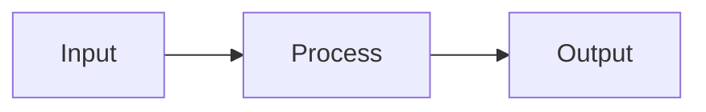

</div>
<div>

**Examples**:
- CI/CD: Code → Test → Deploy
- Data: Extract → Transform → Load
- Review: Submit → Analyze → Merge

</div>
</div>


---

## What is an Autonomous Workflow?

**Autonomous Workflow** (Agentic Workflow): A system that makes decisions and takes actions without human intervention

**Key Characteristics**:
- Self-directed decision making
- Adaptive to changing conditions
- Continuous execution without supervision
- Learn from outcomes (in advanced systems)

---

<!-- _class: lead -->
<!-- _paginate: false -->
<!-- _footer: "" -->

# Part 2: Agent Types

Reflex & Learning Agents

---

## Agent Types: Overview

<div class="columns">
<div>

**Reflex Agents**
- React to current input only
- No memory of past states
- Fast, simple, predictable

</div>
<div>

**Learning Agents**
- Improve from experience
- Maintain state and memory
- Adapt behavior over time

</div>
</div>

<style scoped>
.columns { display: grid; grid-template-columns: 1fr 1fr; gap: 2em; }
.columns h3 { margin: 0 0 0.5em 0; font-size: 1.3em; }
.columns ul { margin: 0; padding-left: 1.2em; line-height: 1.5; }
section { padding-bottom: 3em !important; }
</style>

---

## Reflex Agent: The Thermostat

**🌡️ Simple Rule-Based System**

<div class="columns">
<div>

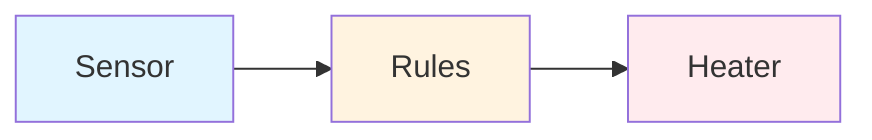

</div>
<div>

**Rules**: `IF temp < 20°C → ON` | `IF temp > 22°C → OFF`

**Pattern**: Sensor → Condition → Action

**Key**: No memory • Instant • Simple

</div>
</div>

<style scoped>
.columns { display: grid; grid-template-columns: 1.1fr 0.9fr; gap: 1em; }
img[src*="mermaid"] { max-height: 35% !important; max-width: 80% !important; margin: 0.3em auto !important; }
section { padding-bottom: 3.5em !important; }
.columns div { font-size: 0.82em; line-height: 1.3; margin: 0; }
.columns div p { margin: 0.3em 0; }
</style>

---

## Reflex Agent: Characteristics

<div class="reflex-columns">
<div>

### Strengths
- ⚡ Instant reaction to sensor input
- 💰 Low operational cost
- 🎯 Predictable, explainable behavior
- 🐛 Easy to debug and reason about

</div>
<div>

### Constraints
- 🚫 No planning or foresight
- 📚 Cannot learn new responses
- 🔧 Rigid rules require manual updates
- 🌍 Limited to narrow environments

</div>
</div>

---

## Learning Agent: Components

**🧠 Four Key Elements**

<div class="columns">
<div>

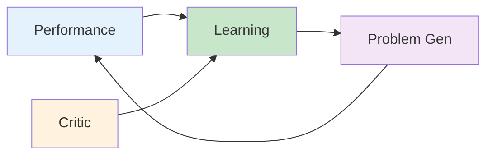

</div>
<div>

**Components**:
- **Performance**: Selects actions
- **Learning**: Improves over time
- **Critic**: Provides feedback
- **Problem Generator**: Suggests exploration

**Key**: Agent improves through experience

</div>
</div>

<style scoped>
.columns { display: grid; grid-template-columns: 1.1fr 0.9fr; gap: 1.2em; }
img[src*="mermaid"] { max-height: 42% !important; max-width: 88% !important; margin: 0.4em auto 0.6em auto !important; }
section { padding-bottom: 3.8em !important; }
.columns div { font-size: 0.9em; line-height: 1.6; margin: 0; padding: 0.2em 0; }
.columns div p { margin: 0.6em 0; }
.columns div ul { margin: 0.5em 0; padding-left: 1.2em; }
</style>

---

<!-- _class: lead -->
<!-- _paginate: false -->
<!-- _footer: "" -->

# Part 3: Architecture Patterns

FSM, BT, GOAP & ReAct

---

## Finite State Machines (FSM)

**State-Based Decision Making**

<div class="columns">
<div>

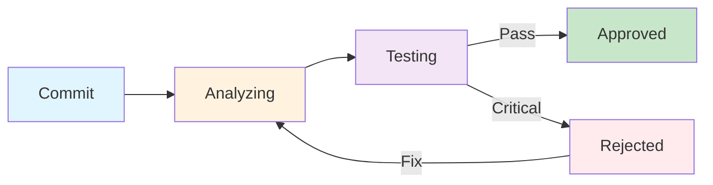

</div>
<div>

**Use Case**: CI/CD pipelines, workflows, automation

**Key**: Clear • Predictable • Debuggable • Workflow-friendly

**In LLM Space**: LangGraph (Python) provides FSM/BT primitives for structured agent workflows

</div>
</div>


---

## Behavior Trees (BT)

**🌳 Hierarchical Task Decomposition**

<div class="columns">
<div>

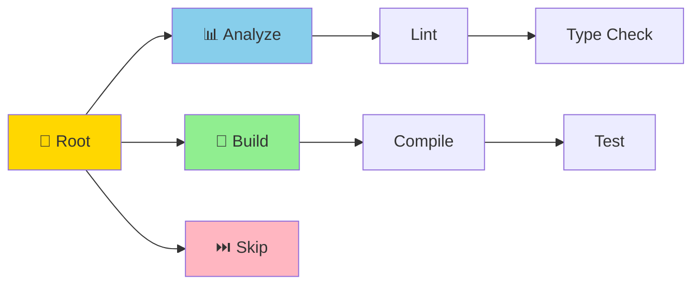

</div>
<div>

**Selector** = first success  
**Sequence** = all in order

**Use Cases**:
- Game AI
- Task planning
- Decision trees
- Hierarchical workflows

**In LLM Space**: LangGraph supports BT patterns for complex agent hierarchies

</div>
</div>


---

## GOAP: Goal-Oriented Action Planning

**Advanced ReAct Planning with Cost Optimization**

<div class="columns">
<div>

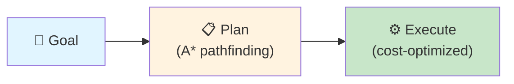

</div>
<div>

**Concept**: ReAct planning with cost-based pathfinding

**Use Case**: Complex multi-step workflows where cost matters

**In LLM Space**: Advanced ReAct variant. Most frameworks use simpler ReAct; GOAP for specialized planning needs.

</div>
</div>

<style scoped>
.columns { display: grid; grid-template-columns: 1.1fr 0.9fr; gap: 1em; }
img[src*="mermaid"] { max-height: 40% !important; max-width: 85% !important; margin: 0.3em auto !important; }
section { padding-bottom: 3.5em !important; }
.columns div { font-size: 0.88em; line-height: 1.4; margin: 0; }
.columns div p { margin: 0.4em 0; }
</style>

---

## ReAct Pattern (Reasoning + Acting)

**Modern LLM Agent Paradigm**

<div class="columns">
<div>

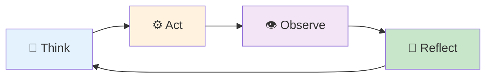

</div>
<div>

**Key**: Reasoning + tool use

**Cycle**: Think → Act → Observe → Reflect

**In LLM Space**: Core pattern in LangChain, VoltAgent, AG2, CrewAI. Most modern LLM frameworks implement ReAct as their default agent paradigm.

</div>
</div>

<style scoped>
.columns { display: grid; grid-template-columns: 1.1fr 0.9fr; gap: 1em; }
img[src*="mermaid"] { max-height: 35% !important; max-width: 85% !important; margin: 0.3em auto !important; }
section { padding-bottom: 3.5em !important; }
.columns div { font-size: 0.85em; line-height: 1.3; margin: 0; }
.columns div p { margin: 0.3em 0; }
</style>

---

## Agent Architecture Patterns

**Comprehensive Comparison**

| **Pattern** | **Mechanism** | **Strengths** | **Best For** |
|:---|:---|:---|:---|
| 🔄 **FSM** | State + Transitions | Simple, predictable | Workflow pipelines |
| 🌳 **BT** | Tree of behaviors | Modular, scalable | Complex task hierarchies |
| 🎯 **GOAP** | A* pathfinding | Dynamic, optimal paths | Goal-driven planning |
| 💭 **ReAct** | Thought → Action → Observation | LLM reasoning | Modern LLM agents |
| 🧠 **Learning Agents** | Memory + Feedback loops | Adaptive, self-improving | Long-term autonomous systems |

<style scoped>
section table { 
  font-size: 0.75em; 
  margin: 0.5em 0; 
  line-height: 1.3; 
}
section { padding-bottom: 3em !important; }
</style>

---

## Agent Architecture Patterns: Recommendations

**Recommendation**: For autonomous development, use **ReAct + Learning** with optional GOAP/BT/FSM for complex workflows

**Framework Mapping**:
- **ReAct**: LangChain, VoltAgent, AG2, CrewAI (default pattern)
- **FSM/BT**: LangGraph provides primitives for structured workflows
- **GOAP**: Specialized planning (advanced ReAct variant, less common)

---

## Memory and Feedback Cycles

**Critical for Learning**

<div class="columns">
<div>

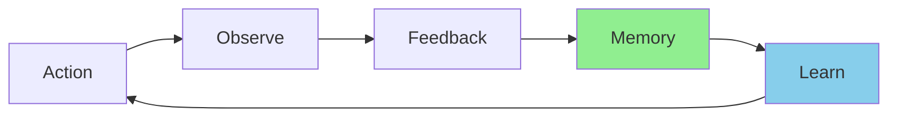

</div>
<div>

**Key**: Memory enables context-aware decisions

**Process**: Act → Observe → Feedback → Memory → Learn → Action

**In LLM Space**: LangChain, AG2, VoltAgent support memory systems. Essential for learning agents and long-running workflows.

</div>
</div>

<style scoped>
.columns { display: grid; grid-template-columns: 1.1fr 0.9fr; gap: 1em; }
img[src*="mermaid"] { max-height: 35% !important; max-width: 85% !important; margin: 0.3em auto !important; }
section { padding-bottom: 3.5em !important; }
.columns div { font-size: 0.85em; line-height: 1.3; margin: 0; }
.columns div p { margin: 0.3em 0; }
</style>

---

<!-- _class: lead -->
<!-- _paginate: false -->
<!-- _footer: "" -->

# Part 4: Model Context Protocol

Standardized Tools & Resources

---

## 🔌 Model Context Protocol (MCP)

**Plugin Architecture for AI Pipelines**

| Concept | Purpose |
|---------|---------|
| **Resources** 📦 | Context and data for AI models |
| **Tools** ⚙️ | Functions AI can execute |
| **Prompts** 📋 | Templated workflows |
| **Sampling** 🎯 | Extension strategies for tool selection |

---

## MCP: Key Benefits

**Key Insight**: MCP is a **generic plugin system** - add tools, resources, and features to any pipeline without modifying core code

**Benefits**:
- Standardized interface
- Easy integration
- Clear capability negotiation
- Secure access
- Composable servers

---

## 🏗️ MCP Architecture

<div class="columns">
<div>

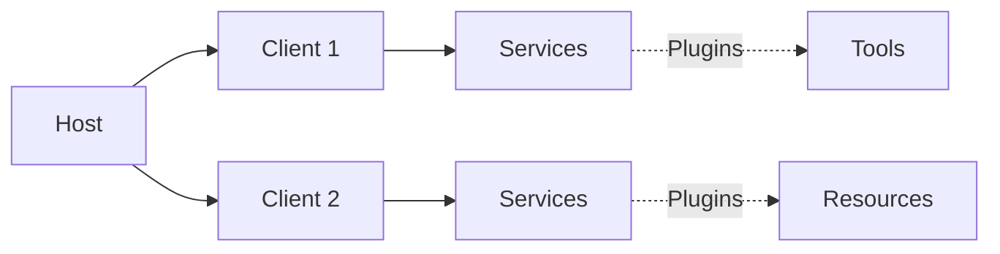

</div>
<div>

**Plugin Architecture**
- Host manages clients
- Servers act as plugins
- Add capabilities without code changes

**Impact**
- Compose multiple servers
- Extend pipelines easily
- Language-agnostic

</div>
</div>

<style scoped>
.columns { display: grid; grid-template-columns: 1.1fr 0.9fr; gap: 1em; }
img[src*="mermaid"] { max-height: 38% !important; max-width: 80% !important; margin: 0.3em auto !important; }
section { padding-bottom: 3.5em !important; }
.columns div { font-size: 0.85em; line-height: 1.3; margin: 0; }
.columns div p { margin: 0.4em 0; }
.columns div ul { margin: 0.4em 0; padding-left: 1.2em; }
</style>

---

<!-- _class: lead -->
<!-- _paginate: false -->
<!-- _footer: "" -->

# Part 5: What Works

Production Patterns & Best Practices

---

## What Works in Production

<div class="columns">
<div>

**Separate Planning Agent**
✅ **Benefits**:
- Dedicated agent for task decomposition
- Clearer reasoning traces
- Better error recovery

</div>
<div>

**Separate Information Gathering**
✅ **Benefits**:
- Focused research/search agents
- Parallel information collection
- Reduced context pollution

</div>
</div>

---

## What Works: Control Flows

<div class="columns">
<div>

**Continuous Workflows**
✅ **Scheduling Patterns**:
- **Queue**: Sequential task processing
- **Stack**: Depth-first execution (interrupts)
- **Async**: Parallel agent coordination with semaphores

</div>
<div>

**Adaptive Patterns**
✅ **Communication**:
- JSON-RPC 2.0 for structured communication
- STDIO for process communication
- Event-driven architectures

</div>
</div>

---

## What Works: Tool Design

✅ **Annotation-Based Descriptions**

```typescript
const tool = {
  name: "search_web",
  description: "Search the web for information",
  parameters: { query: { type: "string", description: "Search query" } },
  annotations: {
    audience: ["assistant"],
    priority: 0.8,
    category: "research"
  }
}
```

<style scoped>
section { padding-bottom: 0.2em !important; }
pre { margin-bottom: 0.2em !important; line-height: 1.2; max-height: 340px; }
p { margin: 0.3em 0 !important; }
</style>

**Benefits**: Clear metadata, better tool selection, priority handling

---

## What Works: Resource Visibility

✅ **Priority and Scoping**

```typescript
resource: {
  uri: "file:///project/README.md",
  annotations: {
    audience: ["user", "assistant"],
    priority: 0.9,  // 0.0-1.0 (1 = required)
    scope: "public"
  }
}
```

**Key Insight**: Annotations help agents choose the right resources

---

## What Works: AI Gateway Pattern

<div class="columns">
<div>

**Problem**: Multiple LLM providers, costs, performance variability

**Solution**: Gateway layer for intelligent routing

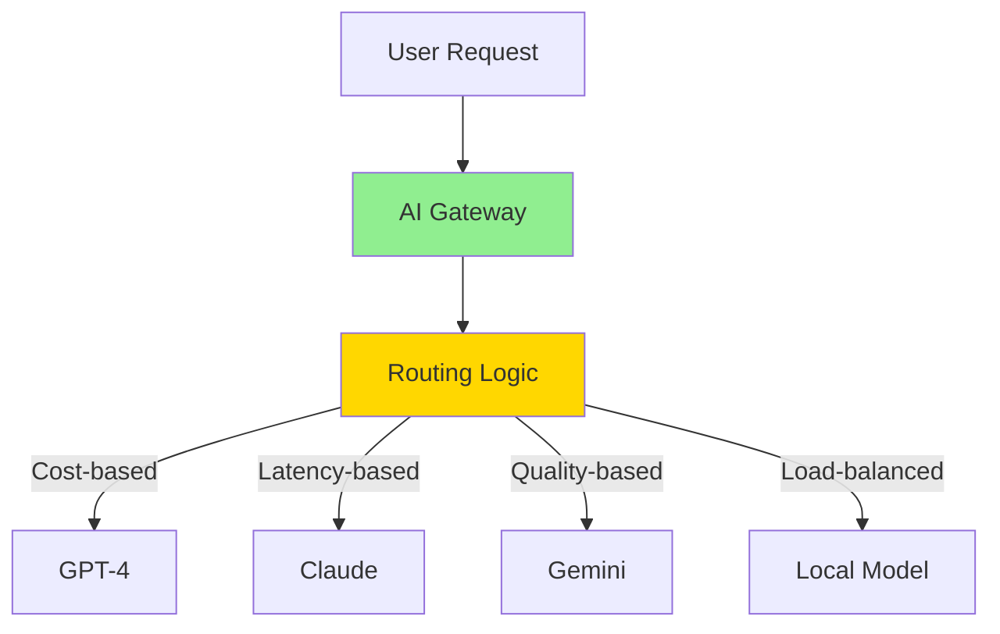

</div>
<div>

**Benefits**:
- Model abstraction
- Cost optimization
- Performance routing
- A/B testing
- Fallback handling

</div>
</div>

<style scoped>
.columns { display: grid; grid-template-columns: 1fr 1fr; gap: 2em; }
img[src*="mermaid"] { max-height: 50% !important; max-width: 90% !important; margin-top: 0.5em !important; }
section { padding-bottom: 3.5em !important; }
.columns div { font-size: 0.9em; }
</style>

---

## AI Gateway: Benefits

✅ **Model Abstraction** - Switch models without code changes • A/B testing

✅ **Cost Optimization** - Route cheap tasks to cheaper models • Budget enforcement

✅ **Reliability** - Automatic failover • Load balancing across instances

✅ **Observability** - Centralized logging • Cost tracking • Performance monitoring

<div class="gateway-summary">
<div>

**When to use it**
- Multiple model providers in production
- Need routing by price, latency, or quality

</div>
<div>

**Operational Tips**
- Instrument routing decisions for audit trails
- Tune thresholds regularly with telemetry

</div>
</div>

<style scoped>
section { padding-bottom: 2em; }
</style>

---

## Scratchpad Pattern

**Working Memory for Complex Tasks**

<div class="columns">
<div>

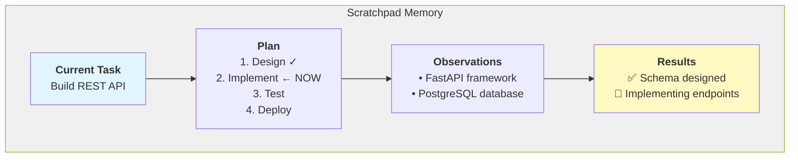

</div>
<div>

**Benefits**:
- Tracks task progress
- Maintains context
- Stores observations

**Use Cases**:
- Long-running tasks
- Multi-step workflows
- Complex reasoning

</div>
</div>

<style scoped>
.columns { display: grid; grid-template-columns: 1.1fr 0.9fr; gap: 1.2em; }
img[src*="mermaid"] { max-height: 47% !important; max-width: 87% !important; margin: 0.4em auto 0.6em auto !important; }
section { padding-bottom: 4.5em !important; }
.columns div { font-size: 0.92em; line-height: 1.6; margin: 0; padding: 0.2em 0; }
.columns div p { margin: 0.6em 0; }
.columns div ul { margin: 0.5em 0; padding-left: 1.2em; }
</style>


---

<!-- _class: lead -->
<!-- _paginate: false -->
<!-- _footer: "" -->

# Part 6: Frameworks

Python, TypeScript & Orchestration

---

## Python Frameworks

**LangChain** (119K+ stars)
- ReAct agents, memory, tools, chains | General-purpose LLM applications

**LangGraph** (LangChain extension)
- FSM/BT patterns, stateful workflows | Structured agent control flows

**AG2 (AutoGen)** (38K+ stars)
- ReAct-based conversations, code execution | Collaborative problem solving

**CrewAI** (30K+ stars)
- Role-playing ReAct agents, workflows | Content creation and research

---

## TypeScript Frameworks

**VoltAgent** - Production-Ready  
ReAct agents, type safety, tool system, built-in observability | Enterprise deployments

**LangChain.js** - Feature Parity  
ReAct agents, memory, streaming | Node.js and edge computing

**Composio** - Integration Platform  
100+ integrations, universal function calling | Integration-heavy applications

---

## Workflow Orchestration

**n8n** - Visual workflow builder | 400+ integrations | Low-code automation

**Apache Airflow** - Python-based DAGs | Production-grade scheduling | Complex dependencies

**Temporal** - Durable execution | Automatic retries | Long-running workflows (days/weeks)

---

<!-- _class: lead -->
<!-- _paginate: false -->
<!-- _footer: "" -->

# Part 7: Examples

Real-World Implementations

---

## Practical Example: Multi-Agent System

**Scenario**: Autonomous code review system

<div class="columns">
<div>

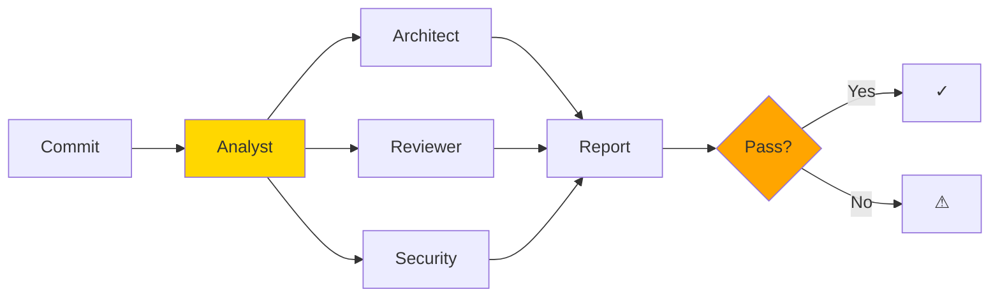

</div>
<div>

**Flow**: Commit → Analyst → Agents → Report → Decision → Approve/Notify

</div>
</div>

<style scoped>
.columns { display: grid; grid-template-columns: 1.1fr 0.9fr; gap: 1.2em; }
img[src*="mermaid"] { max-height: 42% !important; max-width: 88% !important; margin: 0.4em auto 0.6em auto !important; }
section { padding-bottom: 3.8em !important; }
.columns div { font-size: 0.9em; line-height: 1.6; margin: 0; padding: 0.2em 0; }
.columns div p { margin: 0.3em 0; }
</style>

---

## Multi-Agent System: Flow

**Process**:
1. **Analyst Agent** receives code commit
2. **Distributes tasks** to specialized agents:
   - Architect: Code structure review
   - Code Reviewer: Quality checks
   - Security: Vulnerability scanning
3. **Agents report** back to Analyst
4. **Decision point**: Approve or notify based on results

---

## Multi-Agent System: Patterns

**Patterns Used**:
- **ReAct**: Each agent uses Think → Act → Observe cycle
- **FSM**: System states (Commit → Analyzing → Reviewing → Decision)
- **MCP**: Agents communicate via standardized tools/resources
- **Memory**: Agents learn from past reviews to improve

---

## Practical Example: Agent Handoff

**Language-Agnostic Pattern**

<div class="columns">
<div>

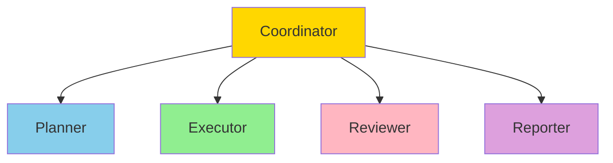

</div>
<div>

**Patterns**:
- **BT**: Task routing
- **MCP**: Standardized interfaces
- **ReAct**: Internal pattern
- **Scratchpad**: Shared memory

</div>
</div>

<style scoped>
.columns { display: grid; grid-template-columns: 1.1fr 0.9fr; gap: 1em; }
img[src*="mermaid"] { max-height: 38% !important; max-width: 80% !important; margin: 0.3em auto !important; }
section { padding-bottom: 3.5em !important; }
.columns div { font-size: 0.82em; line-height: 1.25; margin: 0; }
.columns div p { margin: 0.3em 0; }
.columns div ul { margin: 0.3em 0; padding-left: 1.2em; }
</style>

---

## Agent Handoff: Key Benefits

**Standard interfaces (MCP) allow language-agnostic composition**

**Advantages**:
- Agents can be written in different languages
- Coordinator manages communication
- Each agent focuses on specific tasks
- Easy to add/remove agents
- Scalable architecture

---

## Agent Handoff: Patterns

**Patterns Used**:
- **MCP**: Core pattern - standardized tool/resource definitions
- **Behavior Tree**: Coordinator uses BT for task routing
- **ReAct**: Each agent implements ReAct internally
- **AI Gateway**: Routes requests to appropriate agents/models

---

## What We Use at Wix

**Knowledge Base Pattern** - Infrastructure for semantic search | Build and test easily | RAG foundation

**Workflow Orchestration** - Internal systems + n8n | Agent task scheduling | Multi-step automation

**AI Gateway Adapter** - Model routing (performance, cost, availability) | Single interface, multiple providers

**Internal LLM Tooling** - 80% of daily work automated | Focus on what LLMs can't do | Productivity multiplier

---

## What We Use at Wix: Patterns

**Patterns in Practice**:
- **AI Gateway**: Routes tasks to optimal models (cost/performance)
- **FSM**: Workflow orchestration uses state machines
- **ReAct + Learning**: Agents improve from feedback
- **MCP**: Standardized tool definitions across systems
- **Scratchpad**: Complex tasks use working memory pattern

---

<!-- _class: lead -->
<!-- _paginate: false -->
<!-- _footer: "" -->

# Part 8: Best Practices

Design, Security & Common Pitfalls

---

## Best Practices: Design & Operations

<div class="columns best-practices">
<div>

**Design**
- ✅ Start single → multi-agent
- ✅ Clear responsibilities
- ✅ Use standard protocols (MCP)
- ✅ Proper error handling

</div>
<div>

**Operations**
- ✅ Monitor costs & tokens
- ✅ Implement rate limiting
- ✅ Log all decisions
- ✅ Plan for failures

</div>
</div>

<style scoped>
section { padding-bottom: 3em !important; }
</style>

---

## Best Practices: Security & Testing

<div class="columns best-practices">
<div>

**Security**
- ✅ Validate tool inputs
- ✅ Sandbox code (E2B)
- ✅ Access controls
- ✅ Human-in-the-loop

</div>
<div>

**Testing**
- ✅ Diverse scenarios
- ✅ Benchmark baselines
- ✅ A/B test approaches
- ✅ Measure outcomes

</div>
</div>

<style scoped>
.columns { display: grid; grid-template-columns: 1fr 1fr; gap: 2em; font-size: 0.95em; }
.columns h3 { margin: 0 0 0.5em 0; font-size: 1.2em; }
.columns ul { margin: 0; padding-left: 1.2em; line-height: 1.45; }
section { padding-bottom: 3em !important; }
</style>

---

## Common Pitfalls to Avoid

<div class="columns">
<div>

❌ **Over-Automation**
- Not all tasks need agents
- Some require human judgment

❌ **Ignoring Costs**
- API calls add up quickly
- Monitor continuously

</div>
<div>

❌ **Poor Tool Design**
- Vague descriptions confuse agents
- Complex tools reduce reliability

❌ **Lack of Observability**
- Can't debug what you can't see
- Invest in logging early

</div>
</div>

<style scoped>
section { padding-bottom: 3.5em !important; }
.columns { gap: 2em !important; }
.columns div { font-size: 0.9em !important; line-height: 1.5 !important; }
.columns div p { margin: 0.5em 0 !important; }
.columns div ul { margin: 0.3em 0 !important; padding-left: 1.2em !important; }
</style>

---

<!-- _class: lead -->
<!-- _paginate: false -->
<!-- _footer: "" -->

# Part 9: Conclusion

Takeaways & Resources

---

## Key Takeaways: Architecture & Design

<div class="takeaways-grid">
<div>

**Choose the Right Architecture**
- Simple: Reflex agents
- Complex: Learning agents + planning

**Design Matters**
- Separate planning/execution
- Use scratchpad for reasoning
- Maintain proper control flows

</div>
<div>

**Production Ready**
- Observability is critical
- Cost monitoring is essential
- Security first, always

</div>
</div>

<style scoped>
section { padding-bottom: 3.5em !important; }
.takeaways-grid { gap: 2em !important; }
.takeaways-grid div { font-size: 0.9em !important; }
</style>

---

## Key Takeaways: Standards & Growth

<div class="takeaways-grid">
<div>

**Leverage Standards**
- MCP for tools/resources
- Standard protocols across teams
- Language-agnostic patterns

**Iterate & Improve**
- Start simple → expand to complex
- Measure outcomes continually
- Learn from failures quickly

</div>
<div>

**The Future**
- Better reasoning models (GPT-5, Claude 4)
- Longer context windows (1M+ tokens)
- Lower costs, specialized models
- Shift to "system generation"

</div>
</div>

<style scoped>
section { padding-bottom: 3.5em !important; }
.takeaways-grid { gap: 2em !important; }
.takeaways-grid div { font-size: 0.9em !important; }
</style>

---

## Resources

**Documentation & Links**

<div class="resources-grid">
<div>
<h4>MCP Specification</h4>
<p><a href="https://modelcontextprotocol.io">modelcontextprotocol.io</a></p>
</div>
<div>
<h4>AG2 (AutoGen)</h4>
<p><a href="https://ag2.ai">ag2.ai</a></p>
</div>
<div>
<h4>LangChain Python</h4>
<p><a href="https://python.langchain.com">python.langchain.com</a></p>
</div>
<div>
<h4>Conference Repository</h4>
<p><a href="https://github.com/Algiras/vs-zinios-conference-2025-11-18">github.com/Algiras/vs-zinios-conference-2025-11-18</a></p>
</div>
</div>

<style scoped>
section { padding-bottom: 1.2em !important; }
</style>

---

<!-- _class: lead -->
<!-- _paginate: false -->
<!-- _footer: "" -->

# Questions?

---

<!-- _class: lead -->
<!-- _paginate: false -->
<!-- _footer: "" -->

# Thank You!

**Conference Repository**

https://github.com/Algiras/vs-zinios-conference-2025-11-18


<style scoped>
p {
  margin: 0.8em 0;
  font-size: 1.1em;
}
img { 
  max-width: 200px !important; 
  max-height: 200px !important;
  width: auto !important;
  height: auto !important;
  margin-top: 1.5em !important;
  display: block !important;
  margin-left: auto !important;
  margin-right: auto !important;
}
</style>

---

<!-- _class: lead -->
<!-- _paginate: false -->
<!-- _footer: "" -->

## Backup Slides

---

## Detailed FSM Example

```python
class State:
    def enter(self): pass
    def execute(self): pass
    def exit(self): pass
    def check_transitions(self): return None

class AnalyzingState(State):
    def execute(self):
        run_code_analysis()
    
    def check_transitions(self):
        if issues_found():
            return TestingState()
        return IdleState()

class FSM:
    def __init__(self, initial_state):
        self.current_state = initial_state
        self.current_state.enter()
    
    def update(self):
        self.current_state.execute()
        next_state = self.current_state.check_transitions()
        if next_state:
            self.current_state.exit()
            self.current_state = next_state
            self.current_state.enter()
```

<style scoped>
code { font-size: 0.6em; line-height: 1.25; }
section { padding-bottom: 3em !important; }
</style>

---

## Behavior Tree Node Types

<div class="columns">
<div>

### Sequence Node
- Runs children left-to-right
- Stops on first **FAILURE**
- Returns SUCCESS if all pass
- Use for: Required steps

### Selector Node
- Runs children left-to-right
- Stops on first **SUCCESS**
- Returns FAILURE if all fail
- Use for: Fallback options

</div>
<div>

### Decorator Node
- Modifies child behavior
- Inverter, Repeater, etc.
- Single child only

### Leaf Nodes
- **Condition**: Check state
- **Action**: Do something
- No children

</div>
</div>

<style scoped>
.columns { display: grid; grid-template-columns: 1fr 1fr; gap: 2em; font-size: 0.9em; }
section { padding-bottom: 2.5em !important; }
</style>

---

## GOAP Planning Algorithm

<div class="columns">
<div>

### A* Search Process
1. Start with current state
2. Try all possible actions
3. Calculate costs
4. Choose lowest cost path
5. Return action sequence

### World State
- Key-value pairs
- `has_weapon: true`
- `ammo: 10`

</div>
<div>

### Action Structure
- **Preconditions**: What's needed
- **Effects**: What changes
- **Cost**: How expensive

### Planning
- Build action graph
- Find cheapest path
- Execute in sequence

</div>
</div>

<style scoped>
.columns { display: grid; grid-template-columns: 1fr 1fr; gap: 2em; font-size: 0.9em; }
section { padding-bottom: 2.5em !important; }
</style>

---

## MCP Tool Structure

<div class="columns">
<div>

### Core Components
- **name**: Unique identifier
- **description**: What it does  
- **inputSchema**: JSON Schema
- **outputSchema**: Output format

### Annotations
- **audience**: `["user", "assistant"]`
- **priority**: `0.0` to `1.0`
- **category**: Grouping

</div>
<div>

### Example: web_search
```json
{
  "name": "web_search",
  "description": "Search web",
  "input": {
    "query": "required",
    "max_results": "optional"
  },
  "output": {
    "results": "array"
  }
}
```

</div>
</div>

<style scoped>
code { font-size: 0.6em; line-height: 1.25; }
section { padding-bottom: 3em !important; }
.columns { font-size: 0.85em; }
</style>
