<!-- _paginate: false -->
<!-- _footer: "" -->
<!-- _class: lead -->

# Autonomous Development Workflows

Building AI Systems That Code Independently

---

## About Me

**🧑‍💻 Algimantas Krasauskas**  
AI Tool Developer at Wix

**Focus:** Autonomous AI systems | LLM orchestration | Developer productivity

**Background**: Building scalable AI systems & intelligent workflows

**GitHub**: https://github.com/Algiras/vs-zinios-conference-2025-11-18


<style scoped>
img { max-width: 150px !important; }
</style>

---

## Our Talk Today

**Learn how to build work environments where LLMs autonomously complete programming tasks**

**Topics**:
- Autonomous workflow environments and architectures
- Agent types and decision-making patterns
- What works (and what doesn't) in production
- Available frameworks and tools
- Real-world implementation patterns

---

## Three Deployment Environments

### 1. Local (CLI-Based)
Shell scripts, command-line tools | Direct developer interaction | Fast iteration

### 2. Remote (Single Agent)  
Web UI with one running agent | Centralized execution | User-initiated workflows

### 3. Distributed Remote
Multi-agent coordination | Scheduling and task distribution | Production-scale systems

---

## What is a Workflow?

**Workflow**: A sequence of steps to accomplish a task


**Examples**:
- CI/CD pipeline: Code → Test → Build → Deploy
- Data processing: Extract → Transform → Load
- Code review: Submit → Analyze → Review → Merge

---

## What is an Autonomous Workflow?

**Autonomous Workflow** (Agentic Workflow): A system that makes decisions and takes actions without human intervention

**Key Characteristics**:
- Self-directed decision making
- Adaptive to changing conditions
- Continuous execution without supervision
- Learn from outcomes (in advanced systems)

---

## Agent Types: Overview

Two fundamental categories:

1. **Reflex Agents**
   - React to current input only
   - No memory of past states
   - Fast, simple, predictable

2. **Learning Agents**
   - Improve from experience
   - Maintain state and memory
   - Adapt behavior over time

---

## Reflex Agent: The Thermostat

**🌡️ Simple Rule-Based System**

```mermaid
graph LR
    SENSOR["📊 Sensor<br/>Temp Input"] --> RULE["⚙️ Rules<br/>IF/THEN"]
    RULE --> HEATER["🔥 Actuator<br/>Heat Output"]
    
    style SENSOR fill:#e1f5ff
    style RULE fill:#fff3e0
    style HEATER fill:#ffebee
```



**Rules**: `IF temp < 20°C → ON` | `IF temp > 22°C → OFF`  
**Pattern**: Sensor → Condition → Action

---

## Reflex Agent: Characteristics

<div class="reflex-columns">
<div>

### Strengths
- ⚡ Instant reaction to sensor input
- 💰 Low operational cost
- 🎯 Predictable, explainable behavior
- 🐛 Easy to debug and reason about

</div>
<div>

### Constraints
- 🚫 No planning or foresight
- 📚 Cannot learn new responses
- 🔧 Rigid rules require manual updates
- 🌍 Limited to narrow environments

</div>
</div>

<style scoped>
.reflex-columns { display: grid; grid-template-columns: repeat(2, minmax(0, 1fr)); gap: 2.2em; margin: 2.2em 0; font-size: 0.9em; }
.reflex-columns h3 { margin: 0 0 0.4em 0; font-size: 1.15em; }
.reflex-columns ul { margin: 0; padding-left: 1.2em; line-height: 1.45; }
</style>

---

## Learning Agent: Architecture


---

## Learning Agent: Components

**🧠 Four Key Elements**:

- **📊 Performance Element** (the "brain"): Selects actions
- **🎓 Learning Element**: Improves performance over time  
- **📈 Critic**: Provides feedback on actions
- **🔍 Problem Generator**: Suggests exploratory actions

**💡 Key Insight**: Agent improves through experience

---

## Finite State Machines (FSM)

**State-Based Decision Making**


**Use Case**: CI/CD pipelines, code review workflows, development automation

---

## Behavior Trees (BT)

**🌳 Hierarchical Task Decomposition**

```mermaid
graph LR
    ROOT["🎯 Root<br/>Selector"] 
    ROOT --> A["📊 Analyze"]
    ROOT --> B["🔨 Build"]
    ROOT --> S["⏭️ Skip"]
    A --> L["Lint"]
    L --> T["Type Check"]
    B --> C["Compile"]
    C --> E["Test"]
    style ROOT fill:#FFD700
    style A fill:#87CEEB
    style B fill:#90EE90
    style S fill:#FFB6C1
```



**Selector** = first success | **Sequence** = all in order

---

## GOAP: Goal-Oriented Action Planning

**🚀 Dynamic Planning**


**Total Cost**: 10 | **Method**: A* pathfinding

---

## Agent Architecture Patterns

### Comprehensive Comparison

| **Pattern** | **Mechanism** | **Strengths** | **Best For** |
|:---|:---|:---|:---|
| 🔄 **FSM** | State + Transitions | Simple, predictable | Workflow pipelines |
| 🌳 **BT** | Tree of behaviors | Modular, scalable | Complex task hierarchies |
| 🎯 **GOAP** | A* pathfinding | Dynamic, optimal paths | Goal-driven planning |
| 💭 **ReAct** | Thought → Action → Observation | LLM reasoning | Modern LLM agents |
| 🧠 **Learning Agents** | Memory + Feedback loops | Adaptive, self-improving | Long-term autonomous systems |

**Recommendation**: For autonomous development, use **ReAct + Learning** with optional GOAP/BT for complex workflows

<style scoped>
section table { font-size: 0.75em; margin: 0.5em 0; line-height: 1.3; }
section table td { padding: 0.3em 0.2em; }
</style>

---

## ReAct Pattern (Reasoning + Acting)

**Modern LLM Agent Paradigm**

```mermaid
graph LR
    THOUGHT["💭 Thought<br/>Agent reasoning"]
    ACTION["⚙️ Action<br/>Execute tool/code"]
    OBS["👁️ Observation<br/>Get result"]
    REFLECT["🔄 Reflect<br/>Process outcome"]
    
    THOUGHT --> ACTION
    ACTION --> OBS
    OBS --> REFLECT
    REFLECT --> THOUGHT
    
    style THOUGHT fill:#e3f2fd
    style ACTION fill:#fff3e0
    style OBS fill:#f3e5f5
    style REFLECT fill:#c8e6c9
```



**Key Advantage**: Combines reasoning with tool use - ideal for code generation and problem-solving

---

## Memory and Feedback Cycles

**Critical for Learning**


<style scoped>
svg { height: 420px !important; }
</style>

**Key Insight**: Memory enables context-aware decision making

---

## 🔌 Model Context Protocol (MCP)

**Standardized Tool and Resource Definition**

| Concept | Purpose |
|---------|---------|
| **Resources** 📦 | Context and data for AI models |
| **Tools** ⚙️ | Functions AI can execute |
| **Prompts** 📋 | Templated workflows |
| **Sampling** 🎯 | Extension strategies for tool selection |

**Benefits**: Standardized interface • Easy integration • Clear capability negotiation • Secure access

---

## 🏗️ MCP Architecture

```mermaid
graph LR
  subgraph Host["🖥️ Host"]
    H["Host<br/>Manager"]
    C1["Client 1"]
    C2["Client 2"]
    H --> C1
    H --> C2
  end

  subgraph Local["📁 Local"]
    S1["Files<br/>Server"]
    S2["DB<br/>Server"]
    C1 --> S1
    C2 --> S2
  end

  subgraph Remote["☁️ Remote"]
    S3["APIs<br/>Server"]
    H --> S3
  end
  
  style Host fill:#e3f2fd
  style Local fill:#f3e5f5
  style Remote fill:#fff3e0
```



<style scoped>
svg { height: 320px !important; margin: 0 !important; }
p { margin: 0.35em 0 !important; }
section { padding-bottom: 0.4em !important; }
.mcp-highlights { display: flex; gap: 1.8em; margin-top: 0.8em; font-size: 0.95em; }
.mcp-highlights div { flex: 1; }
</style>

<div class="mcp-highlights">
<div>
**Key Strength**

- Host manages multiple clients
- Each client connects to dedicated services

</div>
<div>
**Operational Impact**

- Centralized governance and logging
- Easy to extend with new clients or servers

</div>
</div>

---

## What Works in Production

<div class="columns">
<div>

### Separate Planning Agent
✅ **Benefits**:
- Dedicated agent for task decomposition
- Clearer reasoning traces
- Better error recovery

</div>
<div>

### Separate Information Gathering
✅ **Benefits**:
- Focused research/search agents
- Parallel information collection
- Reduced context pollution

</div>
</div>

<style scoped>
.columns { display: grid; grid-template-columns: 1fr 1fr; gap: 2em; }
</style>

---

## What Works: Control Flows

<div class="columns">
<div>

### Continuous Workflows
✅ **Scheduling Patterns**:
- **Queue**: Sequential task processing
- **Stack**: Depth-first execution (interrupts)
- **Async**: Parallel agent coordination with semaphores

</div>
<div>

### Adaptive Patterns
✅ **Communication**:
- JSON-RPC 2.0 for structured communication
- STDIO for process communication
- Event-driven architectures

</div>
</div>

<style scoped>
.columns { display: grid; grid-template-columns: 1fr 1fr; gap: 2em; }
</style>

---

## What Works: Tool Design

✅ **Annotation-Based Descriptions**

```typescript
const tool = {
  name: "search_web",
  description: "Search the web for information",
  parameters: { query: { type: "string", description: "Search query" } },
  annotations: {
    audience: ["assistant"],
    priority: 0.8,
    category: "research"
  }
}
```

<style scoped>
section { padding-bottom: 0.2em !important; }
pre { margin-bottom: 0.2em !important; line-height: 1.2; max-height: 340px; }
p { margin: 0.3em 0 !important; }
</style>

**Benefits**: Clear metadata, better tool selection, priority handling

---

## What Works: Resource Visibility

✅ **Priority and Scoping**

```typescript
resource: {
  uri: "file:///project/README.md",
  annotations: {
    audience: ["user", "assistant"],
    priority: 0.9,  // 0.0-1.0 (1 = required)
    scope: "public"
  }
}
```

**Key Insight**: Annotations help agents choose the right resources

---

## What Works: Advanced Patterns

**Three key patterns enhance agent capabilities**:

1. **Enriched Reasoning**: Chain-of-Thought, self-critique to improve decision-making

2. **Custom Control Flows**: Bespoke execution loops (state machines) vs. built-in tool calling

3. **Scratchpad Pattern**: External working memory to track progress and reasoning

---

## Scratchpad Pattern

**Working Memory for Complex Tasks**

```mermaid
graph TB
    subgraph SCRATCHPAD["Scratchpad Memory"]
        TASK["<b>Current Task</b><br/>Build REST API"]
        PLAN["<b>Plan</b><br/>1. Design ✓<br/>2. Implement ← NOW<br/>3. Test<br/>4. Deploy"]
        OBS["<b>Observations</b><br/>• FastAPI framework<br/>• PostgreSQL database"]
        RESULTS["<b>Results</b><br/>✅ Schema designed<br/>🔄 Implementing endpoints"]
        
        TASK --> PLAN
        PLAN --> OBS
        OBS --> RESULTS
    end
    
    style SCRATCHPAD fill:#f0f0f0
    style TASK fill:#e1f5ff
    style RESULTS fill:#fff9c4
```



<style scoped>
svg { height: 360px !important; }
</style>


---

## Python Frameworks

**LangChain** (119K+ stars)
- Agents, memory, tools, chains | General-purpose LLM applications

**AG2 (AutoGen)** (38K+ stars)
- Agent conversations, code execution | Collaborative problem solving

**CrewAI** (30K+ stars)
- Role-playing agents, workflows | Content creation and research

---

## TypeScript Frameworks

**VoltAgent** - Production-Ready  
Type safety, tool system, built-in observability | Enterprise deployments

**LangChain.js** - Feature Parity  
Agents, memory, streaming | Node.js and edge computing

**Composio** - Integration Platform  
100+ integrations, universal function calling | Integration-heavy applications

---

## Workflow Orchestration

**n8n** - Visual workflow builder | 400+ integrations | Low-code automation

**Apache Airflow** - Python-based DAGs | Production-grade scheduling | Complex dependencies

**Temporal** - Durable execution | Automatic retries | Long-running workflows (days/weeks)

---

## AI Gateway Pattern

**Problem**: Multiple LLM providers, costs, performance variability

**Solution**: Gateway layer for intelligent routing


<style scoped>
svg { height: 320px !important; }
.gateway-summary { display: flex; gap: 1.5em; margin-top: 1em; font-size: 0.95em; }
.gateway-summary div { flex: 1; }
</style>

---

## AI Gateway: Benefits

✅ **Model Abstraction** - Switch models without code changes • A/B testing

✅ **Cost Optimization** - Route cheap tasks to cheaper models • Budget enforcement

✅ **Reliability** - Automatic failover • Load balancing across instances

✅ **Observability** - Centralized logging • Cost tracking • Performance monitoring

<div class="gateway-summary">
<div>
**When to use it**

- Multiple model providers in production
- Need routing by price, latency, or quality

</div>
<div>
**Operational tips**

- Instrument routing decisions for audit trails
- Tune thresholds regularly with telemetry

</div>
</div>

<style scoped>
section { padding-bottom: 2em; }
</style>

---

## What We Use at Wix

**Knowledge Base Pattern** - Infrastructure for semantic search | Build and test easily | RAG foundation

**Workflow Orchestration** - Internal systems + n8n | Agent task scheduling | Multi-step automation

**AI Gateway Adapter** - Model routing (performance, cost, availability) | Single interface, multiple providers

**Internal LLM Tooling** - 80% of daily work automated | Focus on what LLMs can't do | Productivity multiplier

---

## Practical Example: Multi-Agent System

**Scenario**: Autonomous code review system

```mermaid
graph LR
    START[Code Commit] --> ANALYST[Analyst Agent]
    ANALYST -->|Task| ARCHITECT[Architect]
    ANALYST -->|Task| REVIEWER[Code Reviewer]
    ANALYST -->|Task| SECURITY[Security]
    
    ARCHITECT --> REPORT[Report]
    REVIEWER --> REPORT
    SECURITY --> REPORT
    
    REPORT --> DECISION{Pass?}
    DECISION -->|Yes| APPROVE[✓ Approve]
    DECISION -->|No| NOTIFY[⚠ Notify]
    
    style ANALYST fill:#FFD700
    style ARCHITECT fill:#87CEEB
    style REVIEWER fill:#90EE90
    style SECURITY fill:#FFB6C1
    style DECISION fill:#FFA500
```



---

## Practical Example: Agent Handoff

**Language-Agnostic Pattern**


**Key**: Standard interfaces (MCP) allow language-agnostic composition

---

## Best Practices

<div class="columns best-practices">
<div>

### Design
- ✅ Start single → multi-agent
- ✅ Clear responsibilities
- ✅ Use standard protocols (MCP)
- ✅ Proper error handling

### Operations
- ✅ Monitor costs & tokens
- ✅ Implement rate limiting
- ✅ Log all decisions
- ✅ Plan for failures

</div>
<div>

### Security
- ✅ Validate tool inputs
- ✅ Sandbox code (E2B)
- ✅ Access controls
- ✅ Human-in-the-loop

### Testing
- ✅ Diverse scenarios
- ✅ Benchmark baselines
- ✅ A/B test approaches
- ✅ Measure outcomes

</div>
</div>

<style scoped>
.columns { display: grid; grid-template-columns: 1fr 1fr; gap: 2em; }
section { padding-bottom: 1em !important; }
</style>

---

## Common Pitfalls to Avoid

<div class="columns">
<div>

❌ **Over-Automation**
- Not all tasks need agents
- Some require human judgment

❌ **Ignoring Costs**
- API calls add up quickly
- Monitor continuously

</div>
<div>

❌ **Poor Tool Design**
- Vague descriptions confuse agents
- Complex tools reduce reliability

❌ **Lack of Observability**
- Can't debug what you can't see
- Invest in logging early

</div>
</div>

<style scoped>
.columns.best-practices { display: grid; grid-template-columns: repeat(2, minmax(0, 1fr)); gap: 2.4em; font-size: 0.95em; }
.columns.best-practices h3 { margin: 0 0 0.5em 0; font-size: 1.2em; }
.columns.best-practices ul { margin: 0; padding-left: 1.2em; line-height: 1.45; }
section { padding-bottom: 1.2em !important; }
</style>

---

## The Future of Autonomous Development

**Trends**:
- 🚀 Better reasoning models (GPT-5, Claude 4, etc.)
- 🚀 Longer context windows (1M+ tokens)
- 🚀 Lower costs per token
- 🚀 Specialized coding models
- 🚀 Better tool use capabilities

**Impact**:
- Agents handle more complex tasks end-to-end
- Shift from "code generation" to "system generation"
- Developers become orchestrators and architects

---

## Getting Started

<div class="columns">
<div>

### 1. Pick Your Environment
- Local for experimentation
- Remote for team use
- Distributed for production

### 2. Choose a Framework
- **Python**: LangChain, AG2, CrewAI
- **TypeScript**: VoltAgent, LangChain.js

</div>
<div>

### 3. Start Simple
- Single-agent workflows first
- Add complexity gradually
- Measure improvements

### Resources
- MCP: https://modelcontextprotocol.io 
- Conference: https://github.com/Algiras/vs-zinios-conference-2025-11-18 

</div>
</div>

<style scoped>
.columns { display: grid; grid-template-columns: 1fr 1fr; gap: 2em; }
</style>

---

## Key Takeaways

<div class="takeaways-grid">
<div>

### Choose the Right Architecture
- Simple: Reflex agents
- Complex: Learning agents + planning

### Design Matters
- Separate planning/execution
- Use scratchpad for reasoning
- Maintain proper control flows

### Production Ready
- Observability is critical
- Cost monitoring is essential
- Security first, always

</div>
<div>

### Leverage Standards
- MCP for tools/resources
- Standard protocols across teams
- Language-agnostic patterns

### Iterate & Improve
- Start simple → expand to complex
- Measure outcomes continually
- Learn from failures quickly

### Stay Current
- Rapidly evolving field
- Track new models & capabilities
- Engage with community innovation

</div>
</div>

<style scoped>
.takeaways-grid { display: grid; grid-template-columns: repeat(2, minmax(0, 1fr)); gap: 2.4em; font-size: 0.95em; line-height: 1.45; }
.takeaways-grid h3 { margin: 0 0 0.45em 0; font-size: 1.2em; }
.takeaways-grid ul { margin: 0 0 1em 0; padding-left: 1.2em; }
section { padding-bottom: 1.1em !important; }
</style>

---

## Resources

### Documentation & Links

<div class="resources-grid">
<div>
<h4>MCP Specification</h4>
<p><a href="https://modelcontextprotocol.io">modelcontextprotocol.io</a></p>

</div>
<div>
<h4>AG2 (AutoGen)</h4>
<p><a href="https://ag2.ai">ag2.ai</a></p>

</div>
<div>
<h4>LangChain Python</h4>
<p><a href="https://python.langchain.com">python.langchain.com</a></p>

</div>
<div>
<h4>Conference Repository</h4>
<p><a href="https://github.com/Algiras/vs-zinios-conference-2025-11-18">github.com/Algiras/vs-zinios-conference-2025-11-18</a></p>

</div>
</div>

<style scoped>
.resources-grid { display: grid; grid-template-columns: repeat(2, minmax(0, 1fr)); gap: 2em; font-size: 0.9em; }
.resources-grid div { background: #f7f7f7; padding: 1em 1.2em; border-radius: 8px; display: flex; flex-direction: column; align-items: flex-start; }
.resources-grid h4 { margin: 0 0 0.25em 0; font-size: 1.05em; }
.resources-grid p { margin: 0; }
.resources-grid a { color: #1565c0; text-decoration: none; }
.resources-grid img { max-width: 130px !important; height: auto !important; margin-top: 0.75em; display: block; }
section { padding-bottom: 1.2em !important; }
</style>

---

<!-- _class: lead -->
<!-- _paginate: false -->
<!-- _footer: "" -->

# Questions?

---

<!-- _class: lead -->
<!-- _paginate: false -->
<!-- _footer: "" -->

# Thank You!

**Conference Repository**: https://github.com/Algiras/vs-zinios-conference-2025-11-18


<style scoped>
img { max-width: 180px !important; margin-top: 1em; }
</style>

---

<!-- _footer: "Backup Slides - For Reference" -->

## Backup Slides

---

## Detailed FSM Example

```python
class State:
    def enter(self): pass
    def execute(self): pass
    def exit(self): pass
    def check_transitions(self): return None

class AnalyzingState(State):
    def execute(self):
        run_code_analysis()
    
    def check_transitions(self):
        if issues_found():
            return TestingState()
        return IdleState()

class FSM:
    def __init__(self, initial_state):
        self.current_state = initial_state
        self.current_state.enter()
    
    def update(self):
        self.current_state.execute()
        next_state = self.current_state.check_transitions()
        if next_state:
            self.current_state.exit()
            self.current_state = next_state
            self.current_state.enter()
```

---

## Behavior Tree Node Types

<div class="columns">
<div>

### Sequence Node
- Runs children left-to-right
- Stops on first **FAILURE**
- Returns SUCCESS if all pass
- Use for: Required steps

### Selector Node
- Runs children left-to-right
- Stops on first **SUCCESS**
- Returns FAILURE if all fail
- Use for: Fallback options

</div>
<div>

### Decorator Node
- Modifies child behavior
- Inverter, Repeater, etc.
- Single child only

### Leaf Nodes
- **Condition**: Check state
- **Action**: Do something
- No children

</div>
</div>

**More Info**: https://github.com/Algiras/vs-zinios-conference-2025-11-18

<style scoped>
.columns { display: grid; grid-template-columns: 1fr 1fr; gap: 2em; }
</style>

---

## GOAP Planning Algorithm

<div class="columns">
<div>

### A* Search Process
1. Start with current state
2. Try all possible actions
3. Calculate costs
4. Choose lowest cost path
5. Return action sequence

### World State
- Key-value pairs
- `has_weapon: true`
- `ammo: 10`

</div>
<div>

### Action Structure
- **Preconditions**: What's needed
- **Effects**: What changes
- **Cost**: How expensive

### Planning
- Build action graph
- Find cheapest path
- Execute in sequence

</div>
</div>

**More Info**: https://github.com/Algiras/vs-zinios-conference-2025-11-18

<style scoped>
.columns { display: grid; grid-template-columns: 1fr 1fr; gap: 2em; }
</style>

---

## MCP Tool Structure

<div class="columns">
<div>

### Core Components
- **name**: Unique identifier
- **description**: What it does  
- **inputSchema**: JSON Schema
- **outputSchema**: Output format

### Annotations
- **audience**: `["user", "assistant"]`
- **priority**: `0.0` to `1.0`
- **category**: Grouping

</div>
<div>

### Example: web_search
```json
{
  "name": "web_search",
  "description": "Search web",
  "input": {
    "query": "required",
    "max_results": "optional"
  },
  "output": {
    "results": "array"
  }
}
```

</div>
</div>

<style scoped>
.columns { display: grid; grid-template-columns: 1fr 1fr; gap: 2em; }
code { font-size: 0.7em; }
</style>

**More Info**: https://github.com/Algiras/vs-zinios-conference-2025-11-18

---
